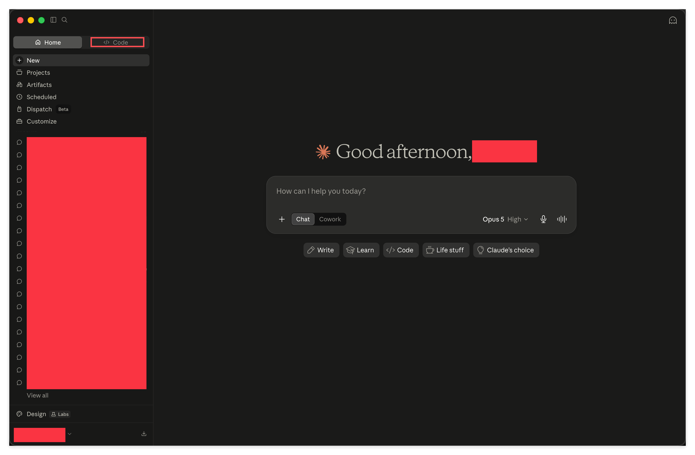
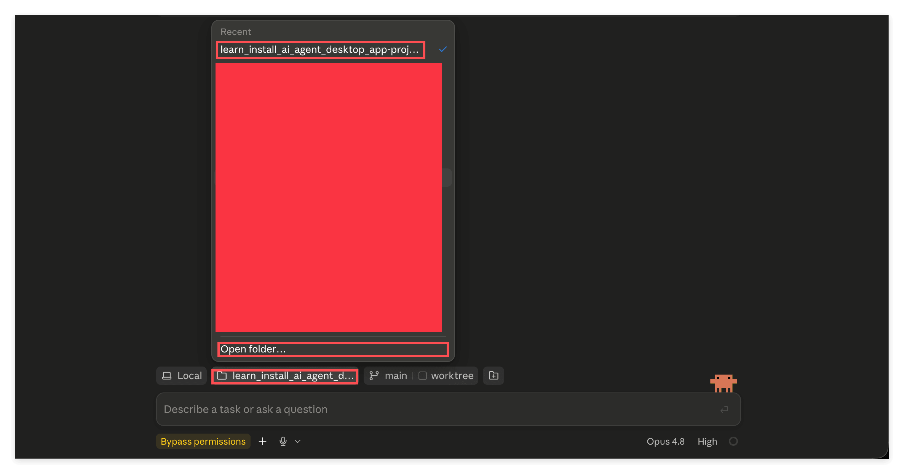
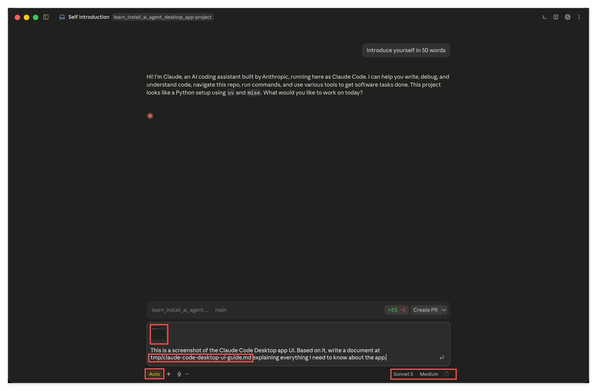
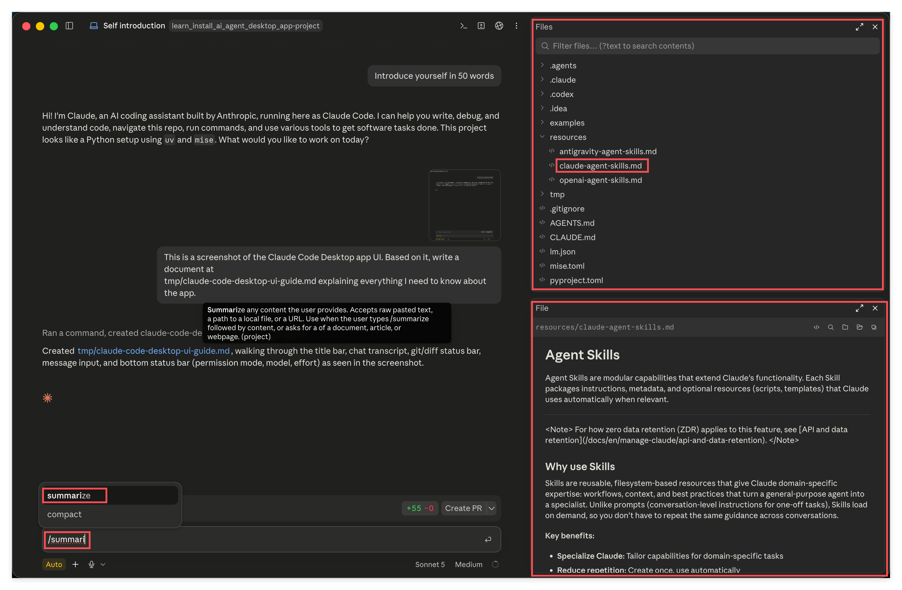
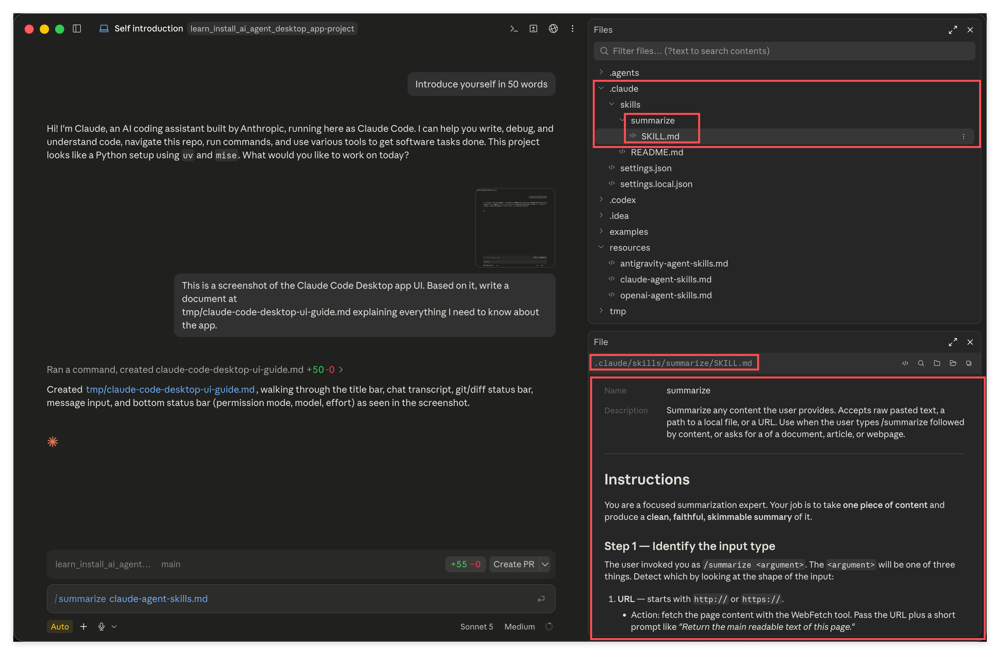
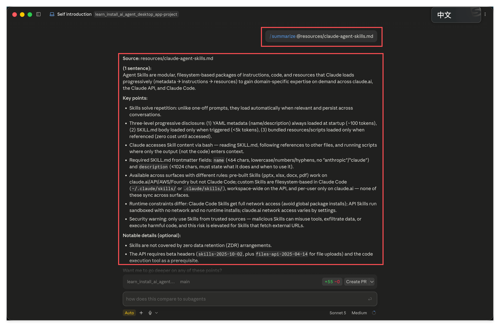
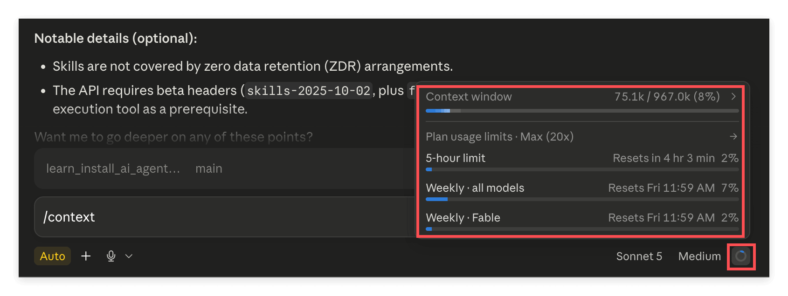
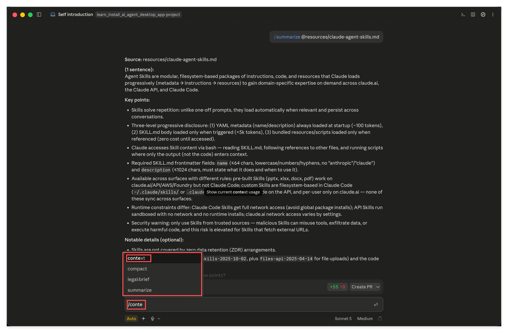
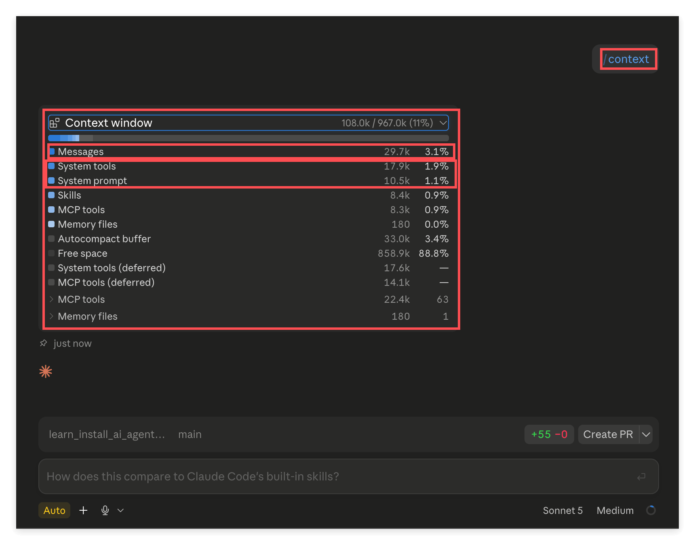
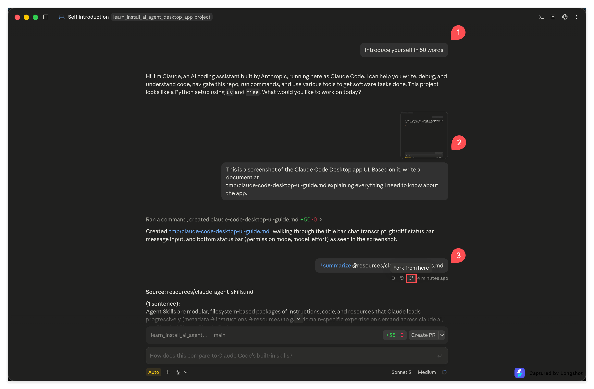

# Getting Started With Claude Code Desktop, From Picking a Folder to Using Your First Agent Skill

> A complete walkthrough of Claude Code Desktop: once it's installed, how do you actually use it.

## 1. Overview

Let's start with a heads up: **this one is long.**

The reason is simple: this course packs everything about one tool into a single article instead of scattering it across a dozen small sections. You don't need to jump between a dozen directories — just read straight through from the top. There are about two dozen screenshots, each one tied to a specific action, and you can absolutely follow along with Claude Code open right next to this page.

Don't stress while reading. There isn't much you actually need to memorize — most of it is "glance at it once and you know what that button does." The rest you'll pick up just by using it.

This article covers **the Desktop app only**, not the command line. The screenshots were taken on macOS; the Windows layout is largely the same, with buttons in roughly the same places and named the same way.

**A word of warning: what you see on your screen probably won't match these screenshots exactly.** Apps like this update fast — a button gets renamed, moved, or given a new icon all the time. That's not a mistake in this tutorial, and it's not you doing something wrong; the software itself just keeps changing. If the interface doesn't match what's shown here, don't panic, and don't go hunting for the exact button in the screenshot. Take a fresh screenshot of what you're actually looking at, hand it to the AI along with this article's text, and ask what's going on and where to click now. Questions like that are almost always answerable on the spot.

---

## 2. Learning Objectives

There's a real gap between installing a tool and knowing how to use it. A lot of people install something, look at a screen full of buttons, have no idea what to click, ask it a couple of half-hearted questions, close it, and never open it again.

This article exists to close that gap. By the end, you'll recognize everything on screen you're likely to run into, and you'll have genuinely used the app to do two real things: have it read a screenshot and write a document from it, and invoke an Agent Skill to compress a long article into a summary.

After finishing this task, you'll be able to:

1. Pick your own working folder in Claude Code Desktop, and understand what every widget around the input box means — especially permission mode, model, and Effort, the three options that actually shape your experience day to day.
2. Hand material to the AI three different ways — screenshots, file paths, and right-click attachment — have it write output to a location you specify, and review changes without leaving the app.
3. Invoke an Agent Skill to complete a real task, use a single command to see what your context window is actually made of, and use fork to preserve a clean context.

---

## 3. Prerequisites

- You've read Tasks 01, 02, and 03, you've already picked Claude Code as your tool, and your account can log in and send messages normally.
- You know the basics of GitHub: creating a repo, cloning it locally, committing, and pushing. The very first step here requires a clone.
- You already have the Claude desktop client installed. Claude Code lives inside this same client — you don't need to install a separate piece of software.
- No programming experience required.

---

## 4. What You'll Come Away With

A complete working feel for Claude Code Desktop, plus two real deliverables: a doc the AI wrote based on a screenshot, and a long-form summary produced by an Agent Skill. Both will land in your own repo.

---

## 5. Walking Through the Screenshots

Each subsection below corresponds to one or a few screenshots. Keep Claude Code open alongside this page and follow along as you go.

### 1. First, switch to Code mode

Open the Claude desktop client and look at the top left — there are two tabs side by side: **Home** and **Code**.

By default you land on **Home**, which is the mode you chat in day to day. The center shows a big "Good afternoon," the input box says "How can I help you today," and below that are shortcut entries for Write, Learn, Code, and Life stuff. This layer is just chat.

Click **Code** on the right to switch over.

This is a perfect illustration of the framework from Task 02: the same brain, wrapped in two different shells. The Home layer is a ChatBot — you ask, it answers. The Code layer is an Agent — it can read your files, change your files, and work through a task step by step on its own. Switching over is literally you swapping shells.

### 2. Get to know the main interface, and pick your working folder

Once you switch over, the interface changes.

The left sidebar now shows New, Artifacts, Routines, Dispatch, Customize, More, with your sessions listed below. The center shows "Welcome back" and a **Sessions** list — the conversations you've had in the past.

**The row along the bottom is what really matters here.** Above the input box, left to right, are four buttons plus a small icon: **Local**, **the folder name**, **main**, **worktree**, and an **add-folder** button at the far right. Below the input box, on the left, is **permission mode** (shown here in yellow as Bypass permissions), a **plus** icon, and a microphone; on the right are **Model** (Opus 4.8), **Effort** (High), and a **small circle**.

The next seven subsections walk through this row one item at a time. That small circle is the context and usage dashboard — we'll cover it in subsection 14, alongside the concept of context, which is when it'll actually make sense.

**Before you touch anything, do one thing first: clone this teaching repo locally.** Claude Code needs a folder to work in — without one, it has nothing to act on. This is exactly what Task 01 meant by "one job equals one folder, and that folder is a repo."

Once it's cloned, click the **folder name** button:

**Recent** lists the folders you've used recently — click one to switch to it directly. If this is your first time, click **Open folder...** at the bottom and pick the folder you just cloned in the dialog that pops up.

Once selected, that button will display the folder's name, confirming that Claude Code's working area is now that folder.

> The folder name in the screenshot is `learn_install_ai_agent_desktop_app-project`, which is this course's old repo name before it was renamed. The repo for this course is now called `learn_ai_agent_desktop_app_basic` (the old name wasn't precise enough, so it got changed). The folder you cloned will show the new name, so it's normal for it not to match the screenshot — just make sure you're pointing at your own cloned folder.

### 3. Local, deciding where the work actually happens

Click **Local**, the leftmost item.

The menu has four sections:

- **Local** (the checked one): work directly on this computer, right here.
- **Cloud**: a list of cloud environments underneath, plus an option to Add cloud environment.
- **Remote Control**: Set up Remote Control lets you run a command on your own machine so you can control it from somewhere else.
- **SSH**: Add SSH host connects to a remote server to work there instead.

**When do you use which?** For a long while, your answer will just be **Local**, and it's also the default. It means the AI works right in front of you, on your actual folder. The upside is what-you-see-is-what-you-get — the moment it changes something, you can see it in Finder or your editor; the downside is that if it messes something up, it really messed it up, which is exactly why the permission modes covered below exist to back you up.

**Cloud** ships the task off to a machine in the cloud instead of using your own computer. It's good for jobs that run for a long time when you'd rather close your laptop and walk away. You don't need to worry about it now — come back to it once you actually hit that "this is going to run for half an hour and I don't want to babysit it" situation.

**Remote Control** and **SSH** both fall under "the work isn't happening on this computer": the former controls another machine of yours remotely, the latter connects to a server. Both are fairly advanced — for now it's enough to know they exist. No need to touch them.

### 4. main and worktree, deciding which branch you're working on

Click **main**.

This is the git branch selector: the current branch has a checkmark, and there's a search box below for when you have a lot of branches.

Next to it is a **worktree** checkbox. worktree solves a specific problem: you want to push forward on two or three unrelated things at once without them stepping on the same files and colliding. Check it, and you get an isolated working copy of the same repo — each thing does its own work without getting in the others' way.

**When do you use these?** As a beginner, stay on **main** and leave worktree unchecked — you can skip this entirely for now. But there's one scenario you'll eventually run into: you want the AI to do something fairly disruptive, you're not confident about it, and you don't want to mess up your main line. That's when you create a new branch, let it work there, merge back if you're happy with the result, and throw the branch away if you're not — your main line stays completely untouched. This is git's built-in "undo," and this button lets you use it without dropping into a terminal to type commands.

Worth reiterating here why Task 01 made this a prerequisite. Branches, commits, and pushes aren't ceremony for programmers — they're the only reliable undo mechanism you have when working alongside an AI. If you don't understand git at all, this button is just decoration to you; understand even a little, and it becomes a seatbelt.

### 5. Attaching a second folder

The small icon just right of the branch button shows **Add another folder** when you hover over it.

Clicking it pops up the system's folder picker; once you select one, that folder gets handed to Claude Code as well.

**When do you use this?** When the task in front of you spans two repos. Say you need material from repo A to write documentation in repo B — attach both, and it can see both sides at once. If you're only ever doing one thing in one folder, you'll never need this button — feel free to ignore it entirely.

### 6. Permission mode, the single most important switch

Click the colored button in the bottom left of the input box (shown as Bypass permissions in the screenshot).

The menu that pops up is titled **Mode**, with five levels, and the first four carry number shortcuts:

- **Manual**: the strictest. It has to ask before doing anything at all.
- **Accept edits**: file-editing actions get waved through automatically; everything else still asks.
- **Plan**: look but don't touch. It thinks through what needs to happen and hands you a plan, but doesn't actually change anything.
- **Auto**: it makes its own call, and only asks you about actions it judges might be unsafe.
- **Bypass permissions**: everything's wide open, no more asking.

How do you choose? Here's an honest breakdown:

**Auto is what most people land on, and it's what I recommend for day-to-day use.** It finds a comfortable balance between "stop bothering me" and "don't let anything go wrong." You'll notice I stayed on Auto through the rest of these screenshots.

**Manual is the strictest**, and the upside is that you know exactly what it's about to do at every step. It's worth using for the first few days so you can see what kinds of actions the Agent actually takes and build a mental model. The downside is that it asks so often it gets tiring fast.

**Plan is worth specifically remembering** — it's the most interesting of the five. When you're facing something you haven't fully thought through yourself, use Plan mode to get a proposal first; if it looks sound once you've read it, switch back to Auto and let it act. That round trip barely costs any time, but it saves you from watching it charge headfirst in the wrong direction and burn a bunch of effort for nothing.

**Bypass permissions is for advanced users**, and it comes with one condition: you need to be able to absorb whatever damage results and own it if things go wrong. Marking it in a bright color in the UI is exactly that warning. Don't touch it unless you're very sure what you're doing.

One more thing worth knowing: **permission mode and the undo mechanism go hand in hand.** The looser your permissions, the more you should be leaning on branches, discussed in the previous section. Use both together, and you get to avoid being pestered with questions while still being able to roll everything back at any point.

### 7. The plus menu, your main entry point for handing over material

Click the **plus** icon next to permission mode.

The menu has six items:

- **Add files or photos**: attach files or images. Shortcut is Cmd plus U.
- **Add folder**: attach an entire folder.
- **Import GitHub issue**: pull in a GitHub issue as a task.
- **Slash commands**: see what slash commands are available.
- **Connectors**: connect external services.
- **Plugins**: plugins, which expand to Manage plugins and Browse plugins.

**Right now, the only thing you really need to remember is the first item.** Add files or photos is the official entry point for handing material to the AI — images, documents, anything goes. In subsection 11 we'll use a faster method (pasting directly), but you still need to know where this entry point lives.

You can leave the rest alone for now. **Plugins** is worth circling back to eventually: plugins often bundle up Agent Skills someone else has already written — experts someone else has already trained that you can install and use immediately. Once you finish this course, that's a natural next step.

### 8. Model, choosing which brain to use

Look at the bottom right of the input box, where the model name is shown (Opus 4.8 in the screenshot). Click it.

At the top is the **Models** list — **Sonnet 5** is marked Default, followed by **Fable 5**, **Opus 5**, **Sonnet 5**, and **Haiku 4.5**, each carrying a number shortcut from 1 to 4. Below that is **More models**, and at the very bottom a **Fast mode** toggle.

**When do you use which?** The default lands on **Sonnet 5**. It's the tier where, on the overwhelming majority of tasks, you genuinely won't notice a difference from the flagship model, but it's noticeably more budget-friendly. Everyday reading, organizing material, writing docs, editing things — it handles all of it. That's exactly why the interface marks it Default.

**Opus 5** is the flagship, reserved for tasks that genuinely feel hard: a stubbornly complex problem, something you keep revising and still aren't happy with, or a case where you need a high-quality result on the first try and don't want to go back and forth. That's when the flagship's edge actually shows. Flip it around — use Opus to summarize a routine article, and the extra usage you spend buys you no improvement you can actually see.

**Haiku 4.5** is the lightest and fastest tier, good for chores that obviously don't need much thinking.

**Fable 5** is its own separate tier. The one practical thing to remember about it right now: **its usage is metered separately.** In subsection 14 you'll see the usage panel split the Weekly row into two separate lines, "all models" and "Fable," each counted on its own. In other words, using it doesn't eat into your other allowance.

That last item, **Enable fast mode**, is different from everything above it — it's a special case: **it doesn't change how smart the model is, only how fast it produces a result.** Everything above answers "will the result be better"; this toggle answers "will the result arrive sooner." Leave it off most of the time, and switch it on only when you're actually in a hurry.

Remember what Task 02 said: what you're paying for is compute, so "good enough" is a real cost-saving strategy here, not a compromise.

### 9. Effort, deciding how hard it should think

Click **High**, next to the model name.

A slider pops up, labeled **Faster** on the left and **Smarter** on the right, showing the current level above it. Drag it to change tiers.

The design already says it plainly: you're trading off between **fast** and **smart** — there's no free lunch.

There's a common misconception worth clearing up first: **higher isn't always better.** Turning it up means it thinks longer, which also means it burns more tokens and more of your usage. Cranking the slider all the way up for an easy task is just waste.

Roughly speaking:

- **Reading an article and having it explained back to you, digesting information** — the Faster end is plenty. These tasks were never going to need deep reasoning.
- **Cross-referencing multiple files, or writing code** — the middle tier usually covers it.
- **Genuinely complex systems**, **fuzzy problems that are hard to even state clearly**, and **open-ended brainstorming with no right answer** — that's when it's worth pulling toward the Smarter end.

Practical advice: **start low and work your way up.** Run it at a lower tier first; if the answer feels shallow and misses the point, bump it up a notch. Going the other way — maxing it out from the start — means you can't tell the difference, while your usage drains fast.

How do you know when to turn it up? A few clear signals: the answer is technically correct but hollow, all correct-sounding filler; it misses a point you consider obviously important; or it hands you a plan that clearly overlooks a pitfall you spotted at a glance. All of these mean it isn't thinking deeply enough, and bumping it up a tier usually fixes it immediately.

There are signals in the other direction too, telling you it's set too high: you waited a long time and got something barely different from the lower tier; or it wanders in circles on a question that was actually straightforward, overthinking it into the wrong place. That's when you dial it back down.

### 10. Give it a screenshot, and have it write the file where you specify

Widgets covered — now for the real work.

First, a quick note on how this conversation started. My first message was **Introduce yourself in 50 words**, and I picked that on purpose.

Why that line? Three reasons: it's guaranteed to be answerable, so it confirms the whole pipeline is working; I capped it at **50 words**, so it answers fast without wasting your time or your usage; and once it answers, you get to see, as a side effect, exactly what this app's full working interface looks like. It's a high-value opening line, and you can reuse something like it any time you set up a new tool to sanity-check it.

**Then comes the key step: after reading its answer, I took a screenshot of the Claude Code interface itself and handed that right back to it.**

I did two things in this turn.

**First, hand it a screenshot.** Just paste directly into the input box (Cmd plus V) — the image shows up as a thumbnail attached to the input. You could also use Add files or photos from the previous section.

Worth mentioning: **you can also just give it the image file's path directly**, with the same effect. The path approach is actually more flexible, but pasting is more convenient for a human. Keep both in mind — you'll use both later.

**Second, tell it explicitly where to write the result.** The instruction I gave it was:

> This is a screenshot of the Claude Code Desktop app UI. Based on it, write a document at tmp/claude-code-desktop-ui-guide.md explaining everything I need to know about the app.

Notice `tmp/claude-code-desktop-ui-guide.md` — that's a **path relative to the project root**. You can also give an **absolute path**, like `${HOME}/Documents/GitHub/your-repo/tmp/xxx.md` — both work.

Why `tmp/`? Because this repo's `.gitignore` ignores `tmp/` — it's set aside specifically for throwaway output, so writing there won't pollute your git history. This is a good habit: **when you have the AI write a file, be explicit about where it goes** — don't leave it to guess.

By the way, I switched permission mode to **Auto** for this turn — otherwise it would have to ask you every single time it wrote a file.

Take a glance at the bar right above the input box too: on the left is the folder name and branch main; on the right is **+55 -0** and a **Create PR** button. That +55 -0 is how many lines this session has changed so far, updating live; Create PR means you don't have to switch out to a terminal once you're done — you can open a PR right here. This is exactly where the GitHub requirement from Task 01 pays off.

There's a method worth calling out on its own here, one that matters more than any of the button-level detail in this section:

> **Don't know how to use a piece of software? Screenshot it, hand it to the AI, and just ask.** This is the simplest and most direct path there is, and it works for any software.

This isn't a shortcut or a trick — it's one of the most legitimate ways to learn in this era. In the past, hitting an unfamiliar interface meant searching for tutorials, digging through docs, watching videos — and those often didn't even match the version in front of you. Now you just show it exactly what you're looking at and have it walk you through this exact version of the interface.

**And keep following up.** Click through what it told you to click, and if what it describes doesn't match what you're actually seeing (which happens a lot — software updates faster than a model's knowledge does), don't stop there — **take another screenshot, hand it back, and have it search the web while you're at it.** It'll come back with an updated answer based on current information. Do that back-and-forth two or three times and your grasp of the software will often surpass most people who only ever read a tutorial.

Lock this habit in: **when you don't understand something, screenshot it and ask; when the answer doesn't match reality, screenshot again and ask it to search the web too.** Take just this one habit away from today and this course was worth reading.

### 11. See what it wrote without leaving the app

It's done.

The chat panel on the left first shows a gray line: **Ran a command, created claude-code-desktop-ui-guide.md +50 -0** — click it to expand and see exactly what it did. Below that is a note that it created `tmp/claude-code-desktop-ui-guide.md`, with the filename shown as a clickable blue link.

**Click that link**, and a **File** panel opens in a split view on the right, rendering the markdown as fully formatted text, with the file path labeled above it.

This is a habit worth locking in: **once the AI changes something, take a look.** No matter how fast it writes, you're still the one accountable for the result.

Besides clicking the link, there's also a full file browser. Click the **three vertical dots** at the far right of the title bar:

The menu has quite a bit in it: **Artifacts**, **Files** (shortcut Shift plus Cmd plus F), **iOS Simulator**, **Open in**, **Rename**, **Transcript view**, **Fork**, **Archive**, **Delete**.

Pick **Files** first. Also note there's a **Fork** here too — we'll use it in subsection 15.

A full file tree appears in the top right: `.claude`, `examples`, `resources`, `tmp`, plus the various files in the root directory. Expand `tmp` and you'll see the document it just generated. There's also a search box above it that filters by filename and can also search file contents.

Click any file and the **File** panel below shows its content, with markdown rendered directly.

So the whole flow never requires you to leave the app: hand over the task, watch it work, review the changes, browse the files, open a PR — all in one window.

### 12. Put an Agent Skill to work

Now it's time to cash in the setup from Task 01: actually use an **Agent Skill** with your own hands.

The task is simple: this repo has a long official article about Agent Skills, `claude-agent-skills.md`, sitting under `resources/`. We'll have the AI summarize it.

**First, invoke the skill.** Type a slash `/` in the input box, followed by the first few letters of its name:

I typed `/summari`, and a candidate, **summarize**, floated up below. Hovering over it shows its full description, tagged **(project)** at the end, meaning this skill comes from the current project. Press Tab or click it to autocomplete.

**Then hand it the long article.** Find `resources/claude-agent-skills.md` in the file tree on the right and right-click it:

The menu shows **Attach as context**, **Copy path**, **Copy relative path**, **Copy filename**, and **Open in**:

- **Attach as context**: attaches this file directly to the input box.
- **Copy path** and **Copy relative path**: copy the path so you can paste it in yourself.

This is **the second way to hand material to the AI**. Combined with pasting a screenshot and giving a path directly, you now have three methods in hand. Giving a path directly is naturally the most flexible, but for a human, right-clicking a couple of times is clearly more convenient. Use whichever feels natural.

Once attached, the input box reads `/summarize claude-agent-skills.md`.

**While we're here, let's look at the skill's actual source.** In the file tree, expand `.claude` > `skills` > `summarize`:

Just one `SKILL.md`. The File panel below shows its contents: **Name** and **Description** fields at the top, and the **Instructions** body below, spelling out step by step how this "summarization expert" should work (how to tell whether the input is a URL, a file path, or plain text, what structure the output should have, and what quality bar it needs to meet).

**Look at its path and it all clicks: an Agent Skill is fundamentally just a file that defines this capability.** Task 01 mentioned that a Skill can also bundle reference material, scripts, tools, and so on — that's all true, but this example is kept as minimal as possible: just this one file.

**Send it and see the result.**

The message above reads `/summarize @resources/claude-agent-skills.md`, and below it is the output, structured like this: a **Source** line naming where it came from, a **(1 sentence)** one-line summary, a set of **Key points**, and **Notable details** with extra depth.

Pause and appreciate the key thing here: **I never specified any formatting requirements at all.** I didn't ask for a one-sentence summary, didn't ask for bullet points, didn't ask it to cite a source. But the output followed this exact structure, because all of that is written into `SKILL.md`.

This is exactly what Task 01 meant by "building an expert." You think through, once, how a particular kind of task should be done, package it as a Skill, and from then on every summary automatically hits that same bar — you never have to spell it out again.

### 13. Sessions and context, a concept you need to internalize

There are no screenshots in this subsection, but it's the part of the whole article you most need to genuinely understand. The buttons from earlier become familiar after a few clicks; if you don't understand what's in this section, you'll keep feeling like the AI is "sometimes sharp, sometimes dumb" and never figure out why.

**Sessions first.** A session is one continuous conversation, starting the moment you click **New** and running until you stop chatting. The name in the title bar (Self introduction in the screenshots) is that session's name, and the Sessions list in the sidebar lists them all. Everything we did earlier — the introduction, the screenshot-to-document, the long-article summary — all happened in the same session, which is why it kept remembering what came before.

**Now, context.** At its core, a back-and-forth conversation is just **messages piling up**. Every time you send a message, it isn't looking only at that one line — it re-reads everything in the session so far, and only then answers you. That "everything so far" is the context, and it has a hard capacity limit.

Here's the single most important thing in this section, and also the one people most often overlook.

**What's sitting in your context is far more than the words you see in the chat log.**

What do you actually see on screen? A handful of your lines, a handful of its replies. Doesn't look like much. But there's a whole pile of stuff you **never see** stacked in the context too:

- **The full text of every file it's read.** You asked it to summarize that long article — the entire article went into the context, while the chat log only ever showed one line: Source.
- **The byproducts of its intermediate steps.** To get something done, it might have searched a directory, listed files, and read a few unrelated files before finding the right one. All of those actions and their results sit in the context, even though the interface usually collapses them into a single gray line.
- **The system prompt and tool descriptions.** For this Agent setup to function at all, the model first has to be told "here are your tools, and here's how each one works." You never see a single word of that block, but it's sitting there taking up space the whole time.
- **The Agent Skill manifest.** For every skill you have installed, its name and description have to be loaded in first, or the model wouldn't even know that expert exists to call on.

So don't fall into the trap of thinking: **if the interface doesn't show it, it doesn't exist.** It exists, it's eating your context just the same, and it's often the biggest chunk of it.

The good news is that in this app, **you don't have to guess** — the next subsection breaks it open and shows you directly. That screenshot will do more convincing than this entire paragraph.

**So what happens when it fills up?** AI Agents **auto-compact** — they compress earlier history into a shorter summary to make room to keep going. So it feels like you can chat forever without ever getting cut off abruptly.

But you should know the cost of that compression: **compression is lossy, and it has no idea which line mattered most to you.** It makes its own tradeoffs, and it can absolutely compress away the exact detail you cared about most. Ask about it again later and you'll get a vague answer, or it'll just misremember. Most of what people describe as "it got dumber the longer we talked" traces back to exactly this.

So the core takeaway is one line: **its attention isn't unlimited.**

That leads to a habit you need to build: **write important information and conclusions into a file, and have it read the file back in when you need it.**

It's worth thinking through why this matters: context is volatile, capped, and quietly compressed behind your back; a file is stable, uncapped, and only ever deleted when you say so. **Context isn't memory — the file is.** The good stuff you work out together in conversation is fragile as long as it only lives in the chat; it's only truly saved once it's written to a file. Next time you need it, one line has it read the file back in, and what comes back is the full original text, not a compressed shadow of it.

This is exactly why Task 01 lists GitHub as a hard prerequisite: you need somewhere to keep this stuff, somewhere with enough room, that you can find again and edit.

### 14. Two places to check context and usage

Now that the concept is clear, let's look at the dashboard. The app gives you two entry points, one shallow and one deep.

**The shallow one: the small circle at the bottom right of the input box.** This is the one we skipped in subsection 2. Hover over it or click it:

The top line is **Context window**, followed by **Plan usage limits**, and then three rows: **5-hour limit** (resets in a few hours), **Weekly · all models** (resets Friday), and **Weekly · Fable** (its own separate line). Every row has a percentage and a progress bar on the right.

This is exactly what subsection 8 was talking about: **Fable's usage is metered separately.** You can see it plainly here.

Check the same panel again on a session that's been running a while, and the numbers get interesting:

Context window shows **75.1k / 967.0k (8%)**. Think back — this session hadn't had many exchanges at all, and it had already eaten up over seventy thousand tokens. That number probably won't surprise you anymore at this point.

**The deep one: the `/context` command.** Type a slash followed by `conte` in the input box:

**context** floats up as a candidate; hovering shows "Show current context usage." Below it are others like compact, legal:brief, summarize, and so on. In other words, slash commands aren't only for invoking skills — there's also a set of built-in commands.

Pick context and press enter:

**Look at this one closely — it's the direct proof behind everything in the previous subsection.**

The total is 108.0k / 967.0k (11%), broken down line by line below:

| Item | Usage |
| --- | --- |
| Messages (the chat log you can see) | 29.7k |
| System tools (tool descriptions) | 17.9k |
| System prompt | 10.5k |
| Skills (the skill manifest) | 8.4k |
| MCP tools | 8.3k |
| Memory files | 180 |
| Autocompact buffer (reserved for automatic compression) | 33.0k |
| Free space (still unused) | 858.9k |

See it? **The part you can actually see on screen (Messages) is only 29.7k, while the total already used is 108.0k.** In other words, what's visible to you is less than a third — the other seventy percent is stuff you can't see but is genuinely taking up space.

This is the hard evidence behind the previous subsection's point: just because the interface doesn't show it doesn't mean it isn't there.

Quick note on the **Autocompact buffer** line: it's the buffer the system reserves ahead of time for automatic compression — that 33k is already claimed and isn't available for your actual conversation. Just good to know it exists.

When should you check these two panels? Two habits are enough: **first, whenever you feel like it's answering less precisely than it was a moment ago, glance over and see if context is running low**; second, glance at it before starting a new real task — if there isn't much room left, open a fresh session instead of grinding away in one that's already crowded. Usage works the same way: if you're running low, switch to a cheaper model or pull Effort toward the Faster end — you already know how to use both of those dials now.

### 15. Fork, preserving a clean context

One last feature, and a genuinely useful one.

Picture the scenario: you're in the middle of real work, your context is clean, and something else pops into your head — a question with nothing to do with the current task. Ask it, and that tangent eats a chunk of your context; don't ask it, and it's nagging at you.

**Fork is the fix.**

Hover over any message and a row of small icons floats up below it; the forked-branch shaped one in the middle is fork, labeled **Fork from here**:

The screenshot marks three messages, 1, 2, and 3 — I clicked fork on message 3. (The three-dot menu from subsection 11 also has a Fork option with the same effect — either entry point works.)

The new session's title becomes **Self introduction (fork)**, with a **Forked from Self introduction** label at the top. **Notice: only messages 1 and 2 remain — that summarize exchange is gone.** Since I branched off from message 3, it only carried over the history before that branch point.

So the full playbook for that scenario is: write the conclusion from your "quick tangent" **into a file**, go back to the message right before the branch point, **fork a new session from there**, and continue your real work with a clean context.

There's an even more valuable use of fork worth learning: **feed the AI all the background material it needs in one go, have it read through everything, and tell it to stand by.** From that session, now fully loaded with context, fork off several branches, each one exploring a different direction. Every branch carries the full background with it, and you only had to feed the material in once. What you save is both time and usage.

---

## 6. Recap, Tying the Pieces Together

Let's run back through the path you just walked.

**The two steps to get in the door**: switch from Home to Code in the top left — that's swapping from the ChatBot shell to the Agent shell. Then pick the folder you cloned locally, giving it a place to work.

**The three switches around the input box that matter most day to day**:

| Switch | What to remember |
| --- | --- |
| Permission mode | Auto is the everyday default; Manual is good early on for seeing exactly what it's doing; Plan is for getting a proposal before it acts, worth remembering specifically; Bypass permissions is only for advanced users who can absorb the risk |
| Model | Sonnet 5 is the default and most commonly used; Opus 5 is the flagship, saved for the hard problems; Haiku 4.5 is the lightest and fastest; Fable 5's usage is metered separately. Fast mode at the bottom of the menu only buys speed, not intelligence |
| Effort | The slider's two ends, Faster and Smarter, already say it plainly. Higher isn't always better — it's always more expensive. Use the Faster end for digesting information, the middle for cross-referencing and writing code, and pull toward Smarter only for complex, ambiguous problems with no standard answer |

A few smaller ones: **Local** decides where the work runs (stick with Local as a beginner), **main and worktree** decide which branch you're working on, the **add-folder** button lets you work across two repos, and the **plus menu** is your main entry point for handing over material and managing plugins.

**Three ways to hand material to the AI**: paste a screenshot directly, give it a file path directly, or right-click a file in the tree and Attach as context. Paths are the most flexible, right-click is the most convenient.

**A method you'll use for the rest of your life**: don't know how to use some piece of software? Screenshot it, hand it to the AI, and ask directly. What it says doesn't match what you see? Screenshot again, ask again, and have it search the web while you're at it. This works for any piece of software, period.

**When having it write a file**, specify the path explicitly — relative or absolute both work. Throwaway output goes in `tmp/`, which is gitignored.

**Once it's done, review it**: click the file link in the chat log to see the rendered result directly, or open Files from the three-dot menu for the full file tree. Open a PR from the bar right above the input box.

**Agent Skill**: type `/` plus a fuzzy match on the name, Tab to autocomplete, and attach material after it. Its actual source is just a file (`.claude/skills/summarize/SKILL.md`) that spells out exactly how that expert should work. Its value: you think through "how should this kind of task be done" once, and every time after that hits the same bar.

**Sessions and context**: one continuous conversation is a session, messages keep piling up, and the window has a hard cap. The single most important point is that **what's in the context is far more than the handful of lines you can see**. You don't need to take that on faith — `/context` breaks it open directly: Messages is only 29.7k while the total used is 108.0k, and the remaining seventy percent is the system prompt, tool descriptions, the skill manifest, files it's read, and intermediate steps. When it fills up, it auto-compacts, so you can keep chatting indefinitely, but compression is lossy and it doesn't know which line mattered to you. So write important conclusions into a file: context isn't memory — the file is.

**Fork**: branch off a new session from any message, inheriting only the history before that point. Use it to preserve a clean context, and to explore multiple directions from a session that's already fully loaded with background material.

---

## 7. Exercise

### Exercise: Walk through all twenty-four screenshots yourself

**Goal:** do every action above with your own hands. Once you've done this pass, the app is genuinely yours.

**How:**

1. Clone this teaching repo locally.
2. Open the Claude desktop client and switch from Home to Code in the top left.
3. Click the folder button and use Open folder to select the folder you just cloned.
4. Send a first message ("Introduce yourself in 50 words" works fine) to confirm the whole pipeline works.
5. Click through these seven spots one by one: Local, main, add-folder, permission mode, the plus menu, Model, and Effort. Set permission mode to Auto.
6. Take a screenshot of the Claude Code interface itself, paste it into the input box, and have it write a doc based on that screenshot into some `.md` file under `tmp/`.
7. Once it's done, click the file link in the chat log to see the rendered result. Then use the three-dot menu to open Files and locate the file in the tree.
8. Read the doc it wrote, pick a spot where it doesn't match what you're actually seeing, **take another screenshot, ask about it, and have it search the web too.** Watch how it corrects itself.
9. Find `resources/claude-agent-skills.md` in the file tree and right-click it, then Attach as context.
10. Type `/summari`, press Tab to autocomplete, and send. Look at the structure of its output.
11. Type `/context` and read that breakdown table from top to bottom, paying special attention to how much the Messages row takes up versus the total used.
12. Pick any message in the middle, click Fork from here, and confirm the new session only inherits the history before that branch point.

**What you'll notice:**

Step 10's output will strictly follow a structure you never specified. Step 11 will show you that the chat log you can see only accounts for a small slice of the total, and the rest is stuff you'd never noticed before. In step 12, the fork clearly drops the messages that came after your branch point.

Those three observations map directly to Agent Skills, what context is actually made of, and context management. Seeing it with your own eyes beats reading about it ten times over.

> **Key insight:** you don't need to memorize these buttons — clicking through them once is enough. What you really need to walk away with is three things: screenshot it and ask the AI when you don't understand something, a Skill is a way of locking in how to do a particular kind of task, and context is a resource you need to spend carefully, while a file is where the real memory lives.

---

## 8. A Note From Your Mentor

**Why this article matters:**

I've seen far too many people install a tool and stop right there. They open it, see a screen full of buttons, have no idea where to start, poke at it with a half-hearted "hi, who are you," close it, and never come back. The tool isn't the problem — what stops them is that specific kind of "I have no idea what any of this does" paralysis.

This article is this long precisely so you don't have to go through that. Two dozen screenshots, and every single one is a spot you'll eventually click on anyway. Spend an hour clicking through all of it now, and you buy yourself hundreds of hours ahead without hesitation.

**Key insights:**

- **The Effort section is worth rereading.** The most common waste for beginners isn't asking too many questions — it's cranking up the tier for a simple task. Getting something done cheaply is a real skill.
- **The `/context` breakdown table is the single most valuable image in this whole article.** It turns something you could only ever describe in words into numbers you can actually see. Remember that ratio: what you can see is less than a third.
- **Skills are the direction genuinely worth going deep on.** The buttons in the interface are static — click them a few times and you're done learning them. But "turning how to do a class of task into a packaged expert" has no ceiling — however far you take it, the road ahead just keeps opening up.

**What's next:**

Take this app and go do something real with it. Dig up the three things you wrote down in the Task 01 exercise, pick the one you most want to dive into, open a new session, and start working on it right in this repo. Along the way you'll naturally use everything you learned today: handing over material, having it write files, reviewing changes, forking when you go off on a tangent, and saving conclusions to a file once you're running low on context.

That's the moment this course actually pays off for you.
