# Claude Code Desktop 上手, 从选定文件夹到用上第一个 Agent Skill

> 一篇走完 Claude Code 桌面版: 装好之后到底怎么用.

## 1. 概览

先打个招呼: **这一篇很长.**

原因很简单, 这门课把一款工具的全部内容都塞在一篇里, 不拆成七零八落的小节. 你不用在十几个目录之间来回跳, 从头顺着读下来就行. 截图有二十几张, 每一张对应一个具体的操作, 你完全可以一边开着 Claude Code 一边照着做.

读的时候别有压力. 真正需要你记住的东西不多, 大部分是 "看一眼就知道那个按钮是干嘛的". 剩下的边用边熟.

这一篇只讲 **Desktop 桌面版**, 不讲命令行. 截图是在 macOS 上截的, Windows 上布局大同小异, 按钮位置和名字基本一致.

**打个预防针: 你打开的界面, 大概率会跟截图对不上.** 这类 App 更新得很快, 一个按钮改名字, 挪位置, 换个图标, 都是常事. 这不是教程写错了, 也不是你操作错了, 是软件本身在持续变. 遇到界面跟截图不一致, 别慌, 也别死抠着截图找那个一模一样的按钮: 自己截一张当下的界面图, 把这一篇的原文一起丢给 AI, 问它这是怎么回事, 现在该点哪儿. 这类问题基本都能当场问清楚.

---

## 2. 学习目标

装好一个工具和会用一个工具, 中间隔着一条不小的沟. 很多人装完之后打开一看, 满屏按钮不知道点哪个, 于是随便问了两句就关掉了, 从此束之高阁.

这一篇要做的就是把这条沟填平. 走完之后, 界面上每一个你会碰到的东西你都认识, 并且你已经用它真真正正做完了两件事: 让它读一张截图写出一份文档, 以及召唤一个 Agent Skill 帮你把一篇长文压成摘要.

学完这个 Task, 你将能够:

1. 在 Claude Code Desktop 里选定你自己的工作文件夹, 并看懂输入框周围每一个 widget 的含义, 尤其是权限模式, 模型和 Effort 这三个真正影响体验的选项.
2. 用截图, 文件路径和右键挂载三种方式把材料交给 AI, 让它把产出写到你指定的位置, 并在不离开 App 的情况下审阅改动.
3. 召唤一个 Agent Skill 完成一次真实任务, 用一条命令看穿上下文的真实构成, 并用 fork 保住一份干净的上下文.

---

## 3. 前置知识

- 读过第 02, 03, 04 篇, 已经选定 Claude Code, 并且账号能正常登录发消息.
- 会 GitHub 的基本操作: 创建 repo, clone 到本地, commit 与 push. 这一篇的第一步就要用到 clone.
- 已经装好了 Claude 的桌面客户端. Claude Code 就住在这个客户端里面, 不需要单独再装一个软件.
- 不需要任何编程经验.

---

## 4. 你将学到什么

一套完整的 Claude Code Desktop 操作手感, 外加两份真实产出: 一份由 AI 根据截图写出来的说明文档, 和一份由 Agent Skill 生成的长文摘要. 两份都会落在你自己的 repo 里.

---

## 5. 跟着截图走一遍

下面每一小节对应一张或几张截图. 建议你把 Claude Code 打开放在旁边, 一边看一边做.

### 1. 先切换到 Code 模式

打开 Claude 桌面客户端, 看左上角, 那里有两个并排的标签: **Home** 和 **Code**.

默认停在 **Home**, 也就是你平时聊天的那个模式. 中间大字写着 Good afternoon, 输入框里是 How can I help you today, 下面还有 Write, Learn, Code, Life stuff 这几个快捷入口. 这一层就是聊天.

点右边那个 **Code**, 切过去.

这里正好印证第 03 篇讲过的骨架: 同一个大脑, 外面套了两层不同的壳. Home 那一层是 ChatBot, 你问一句它答一句; Code 这一层是 Agent, 它能读你的文件, 改你的文件, 自己一步步把事情做完. 切换的这一下, 你就是在换壳.

### 2. 认识主界面, 并选定你的工作文件夹

切过来之后, 界面变了.

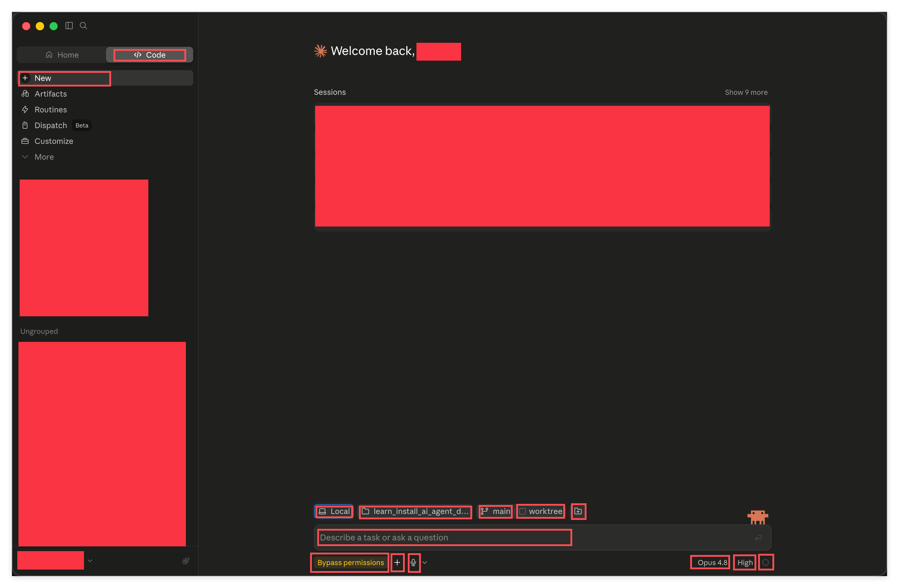

左侧栏变成了 New, Artifacts, Routines, Dispatch, Customize, More, 下面列着你的会话. 中间是 Welcome back 和 **Sessions** 列表, 也就是你过去开过的那些对话.

**真正要认的是底下那一排.** 输入框上方从左到右是四个按钮加一个小图标: **Local**, **文件夹名**, **main**, **worktree**, 以及最右边一个**加文件夹** 的小按钮. 输入框下方左边是**权限模式** (图里是黄色的 Bypass permissions), 一个 **加号**, 一个麦克风; 右边是**模型** (Opus 4.8), **Effort** (High), 和一个**小圆圈**.

接下来的七小节, 就是把这一排一个一个讲清楚. 那个小圆圈是上下文和额度的仪表盘, 我们放到第 14 小节, 跟上下文的概念一起讲, 那时候你才看得懂它.

**动手之前先做一件事: 把这个教学仓库 clone 到你本地.** Claude Code 干活是要有一个文件夹作为地盘的, 没有地盘它无从下手. 这就是第 02 篇说的 "一件事就是一个文件夹, 这个文件夹就是一个 repo".

clone 好之后, 点那个**文件夹名** 按钮:

上面 **Recent** 列的是你最近用过的文件夹, 直接点就能切过去. 如果是第一次用, 点最下面的 **Open folder...**, 在弹出的窗口里选中你刚才 clone 下来的那个文件夹.

选好之后, 这个按钮上会显示文件夹的名字, 说明 Claude Code 现在的地盘就是它了.

> 图里文件夹名字是 `learn_install_ai_agent_desktop_app-project`, 那是这门课的仓库改名前的旧名字. 现在这门课对应的仓库叫 `learn_ai_agent_desktop_app_basic` (旧名字不够精确, 后来改掉了). 你 clone 下来的文件夹名字会是新的这个, 跟图里对不上是正常的, 认准你自己 clone 的那个文件夹就行.

### 3. Local, 决定这活儿在哪儿干

点最左边的 **Local**.

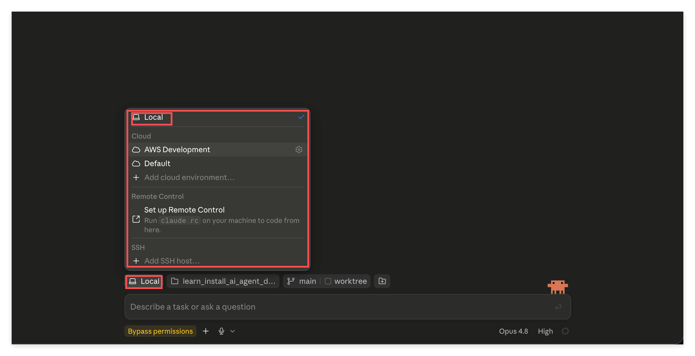

菜单分成四块:

- **Local** (打勾的那个): 直接在你本地这台电脑上干活.
- **Cloud**: 下面挂着几个云端环境, 还能 Add cloud environment 加新的.
- **Remote Control**: Set up Remote Control, 提示你在自己机器上跑一条命令, 就能从别处遥控它干活.
- **SSH**: Add SSH host, 连到一台远程服务器上去干活.

**什么时候用哪个?** 你的答案在很长一段时间里都是 **Local**, 它也是默认值. 它的意思是 AI 直接在你眼皮底下, 在你那个真实的文件夹里改东西. 好处是所见即所得, 它改完你立刻能在 Finder 或者编辑器里看到; 坏处是它改错了就是真改错了, 所以才需要后面讲的权限模式给你兜着.

**Cloud** 是把任务丢到云端的机器上跑, 不占用你自己的电脑. 适合那种要跑很久, 你又想合上笔记本走人的活儿. 现在不用管, 等你哪天真遇到 "这个任务跑半小时我不想守着" 的场景, 再回来点它.

**Remote Control** 和 **SSH** 都属于 "活儿不在这台电脑上" 的情况: 前者是遥控你自己的另一台机器, 后者是连到一台服务器. 这两个都偏专业, 现阶段知道有这么回事就够, 不用碰.

### 4. main 和 worktree, 决定在哪个分支上干

点 **main**.

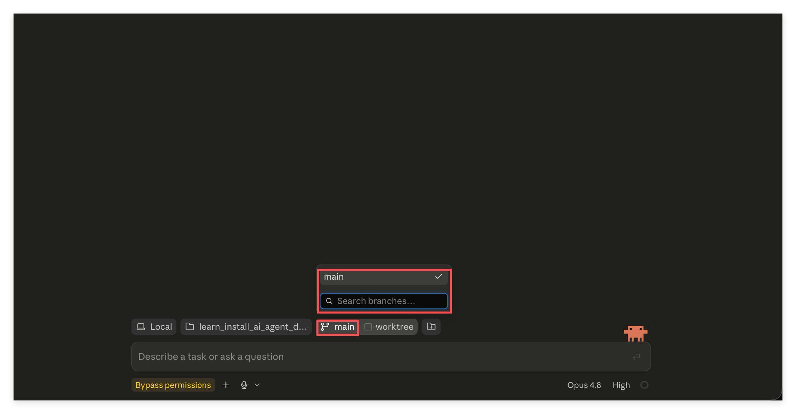

这是 git 分支选择器: 当前分支打着勾, 下面一个搜索框, 分支多的时候能搜.

旁边还有一个 **worktree** 勾选框. worktree 解决的是这样一个问题: 你想同时推进两三件互不相干的事, 又不希望它们改到同一份文件上打架. 勾上它, 就是给同一个仓库开出一份互相隔离的工作副本, 各干各的, 谁也不碍着谁.

**什么时候用它们?** 新手阶段, 待在 **main** 上, worktree 不用勾, 你可以整段跳过. 但有一个场景你迟早会遇到: 你打算让 AI 做一件动静比较大的事, 心里没底, 又不想把主线搞乱. 这时候新建一个分支, 让它在新分支上折腾, 满意就合回去, 不满意就把分支扔掉, 主线一点没脏. 这是 git 给你的后悔药, 而这个按钮让你不用切出去敲命令就能吃到.

这里再强调一遍第 02 篇那个前置的意义. 分支, 提交, 推送这些概念不是给程序员准备的仪式感, 它们是你和 AI 一起干活时唯一可靠的后悔机制. 你要是完全不懂 git, 这个按钮对你就只是个装饰; 懂一点, 它就是安全带.

### 5. 加挂第二个文件夹

分支按钮右边那个小图标, 鼠标停上去会显示 **Add another folder**.

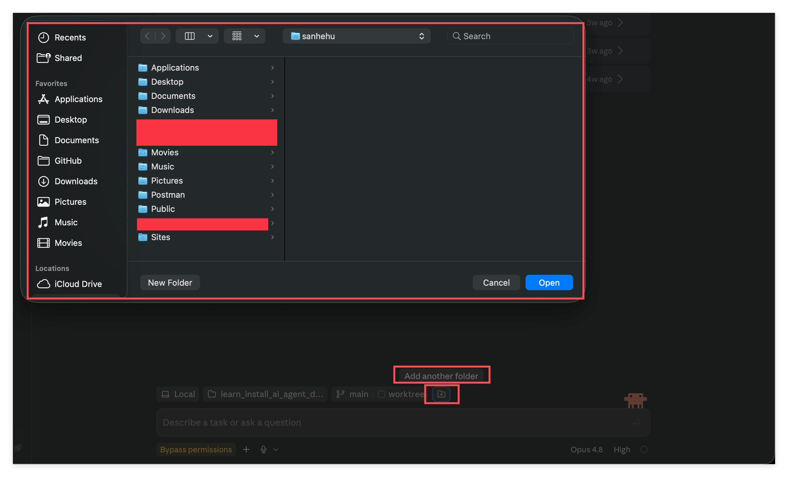

点它会弹出系统的文件夹选择窗口, 选中之后, 这个文件夹也会一并交给 Claude Code.

**什么时候用?** 当你手上的这件事需要跨两个仓库时. 比如你要拿 A 仓库里的资料去写 B 仓库里的文档, 那就把两个都挂上, 它就能同时看到两边. 只做一件事, 只在一个文件夹里折腾的话, 这个按钮你一辈子都用不上, 完全可以忽略.

### 6. 权限模式, 这是最重要的一个开关

点输入框左下角那个彩色的按钮 (图里是 Bypass permissions).

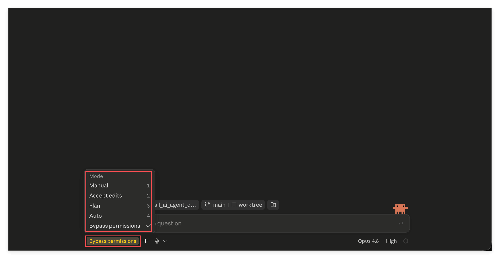

弹出的菜单标题是 **Mode**, 五个档位, 前四个还带着数字快捷键:

- **Manual**: 最严格. 它想做任何一个动作, 都要先问过你.
- **Accept edits**: 改文件这类动作自动放行, 其他的仍然问你.
- **Plan**: 只看不动手. 它会把要做的事想清楚, 给你一份方案, 但不真的去改任何东西.
- **Auto**: 它自己判断, 只有被认为可能不安全的动作才来问你.
- **Bypass permissions**: 全部放开, 不问了.

怎么选? 给你一个实话实说的分布:

**Auto 是绝大多数人的选择, 也是我推荐你日常用的档位.** 它在 "别烦我" 和 "别出事" 之间找到了一个很舒服的平衡点. 你会注意到后面几张截图里, 我用的一直是 Auto.

**Manual 最严格**, 好处是每一步你都清楚它要干什么. 刚上手的头几天可以用它, 顺便看看 Agent 到底会做哪些动作, 心里有个数. 缺点是问得太勤, 用久了会烦.

**Plan 这一档值得你专门记住**, 它是这五个里最有意思的一个. 遇到一件你自己都还没想清楚的事, 先用 Plan 模式让它给个方案, 你看完觉得靠谱, 再切回 Auto 让它动手. 这一来一回花不了多少时间, 但能避免它一头扎进错误的方向, 干了半天全是白干.

**Bypass permissions 是给专业用户的**, 而且有个前提: 你得能为自己的损失兜底, 搞砸了认栽. 界面上把它标成醒目的颜色就是这个意思. 除非你非常清楚自己在干什么, 否则别碰.

还有一条经验: **权限模式和后悔机制是配套的.** 你把权限放得越松, 上一节那个分支就越该用起来. 两者一起用, 你既不用被问得心烦, 又随时能整段退回去.

### 7. 加号菜单, 给它材料的总入口

点权限模式旁边那个 **加号**.

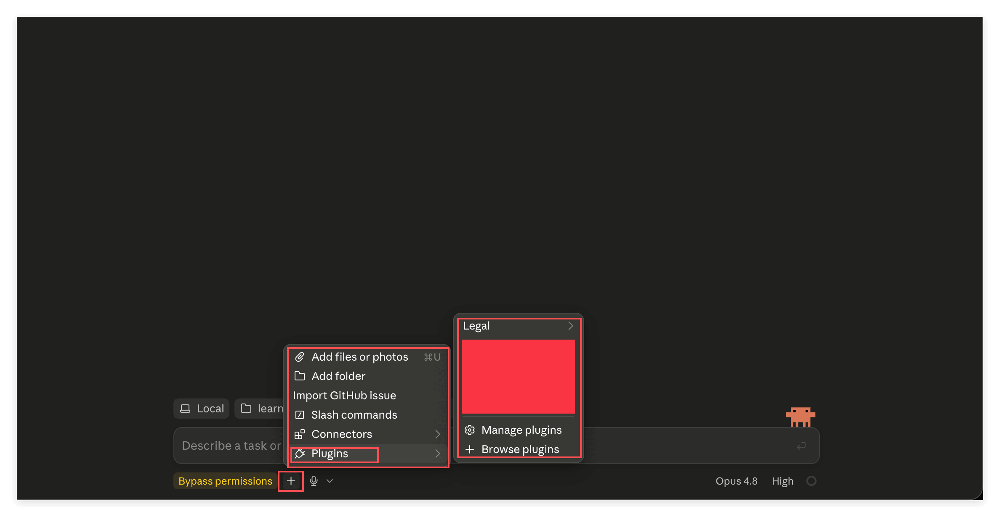

菜单里有六项:

- **Add files or photos**: 挂文件或图片进来. 快捷键是 Cmd 加 U.
- **Add folder**: 挂一整个文件夹.
- **Import GitHub issue**: 把一个 GitHub issue 拉进来当任务.
- **Slash commands**: 看有哪些斜杠命令可以用.
- **Connectors**: 连接外部服务.
- **Plugins**: 插件, 展开之后能 Manage plugins 和 Browse plugins.

**你现在真正要记住的只有第一项.** Add files or photos 是把材料交给 AI 最正规的入口, 图片, 文档, 什么都能挂. 后面第 11 小节我们会用一个更快的办法 (直接粘贴), 但这个入口你得知道在哪儿.

剩下的可以先放着. **Plugins** 那一项值得你以后回头看一眼: 插件里往往打包着别人写好的 Agent Skill, 也就是别人已经调教好的专家, 你装上就能直接用. 等你把这门课走完, 那会是一个很自然的下一步.

### 8. Model, 选哪个大脑

看输入框右下角, 那里写着模型名字 (图里是 Opus 4.8). 点它.

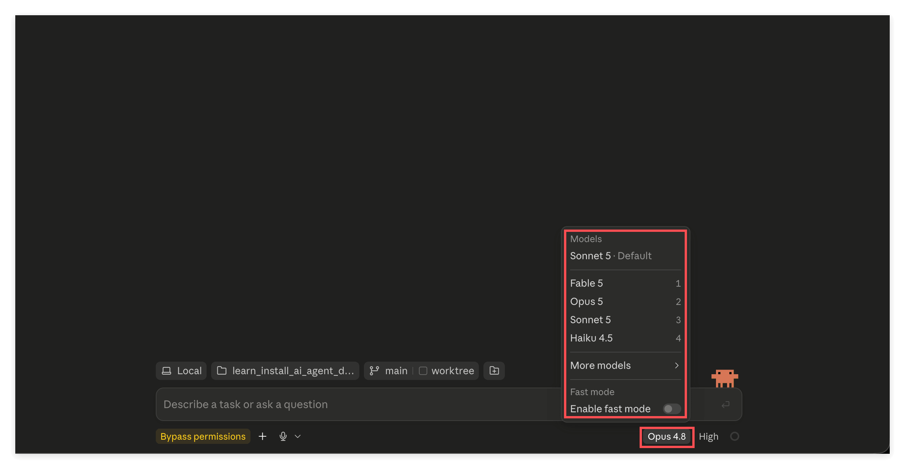

上面是 **Models** 列表, **Sonnet 5** 后面标着 Default, 下面依次是 **Fable 5**, **Opus 5**, **Sonnet 5**, **Haiku 4.5**, 各自带着 1 到 4 的数字快捷键. 再往下是 **More models**, 最底下还有一个 **Fast mode** 开关.

**什么时候用哪个?** 默认停在 **Sonnet 5**. 它是那种绝大多数任务上你根本感觉不出比旗舰差在哪, 但明显更经花的档位. 日常的读文章, 整理资料, 写文档, 改东西, 它全都拿得下. 界面把它标成 Default 就是这个意思.

**Opus 5** 是旗舰, 留给那种你真的觉得吃力的任务: 一个绕不过去的复杂问题, 一份怎么改都不满意的东西, 或者你需要它一次性给出高质量结果不想来回返工. 这种时候旗舰的差距才显得出来. 反过来, 拿 Opus 去读一篇文章做摘要, 你多花的额度买不到任何看得见的提升.

**Haiku 4.5** 是最轻最快的一档, 适合那些明显不需要动脑子的杂活.

**Fable 5** 是单独的一档. 关于它你现在只需要记住一个很实际的点: **它的额度是单独计的.** 后面第 14 小节你会在额度面板里看到 Weekly 那一栏被拆成了 all models 和 Fable 两行, 各算各的. 也就是说用它不占另一份额度.

最后那个 **Enable fast mode** 跟上面几个不一样, 它比较特殊: **它不改变模型有多聪明, 只改变它出结果有多快.** 上面选的是 "结果会不会更好", 这个开关调的是 "结果来得会不会更早". 平时关着就行, 真的赶时间再打开.

记住第 03 篇那句话, 你花的钱买的是算力, 所以 "够用就好" 在这里是一个真实的省钱策略, 不是将就.

### 9. Effort, 让它想多深

点模型名字旁边那个 **High**.

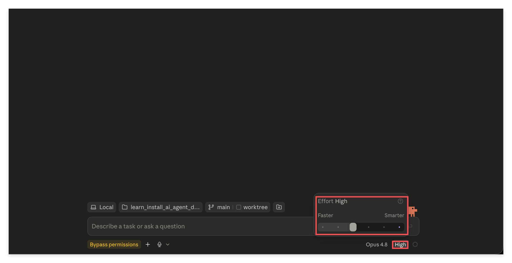

跳出来一个滑块, 左边写着 **Faster**, 右边写着 **Smarter**, 上面显示当前档位. 拖一下就换档.

这个设计已经把话说明白了: 你是在**快** 和**聪明** 之间做取舍, 没有免费的午餐.

这里有个常见误解要先破掉: **不是调得越高越好.** 调高意味着它想得更久, 也意味着更费 token, 更费你的额度. 给一个不难的任务把滑块拉到底, 纯属浪费.

大致这么配:

- **读一篇文章讲给我听, 解读和消化信息** 这类事, 靠 Faster 那一端就够了. 它本来就不需要多深的推理.
- **多个文件交叉比对分析**, 或者**写代码**, 中间档基本够用.
- **很复杂的系统**, **边界模糊说不清楚的问题**, **没有标准答案的头脑风暴**, 才值得往 Smarter 那一端拉.

实操上的建议: **从低往高试.** 先用低档跑一遍, 觉得它答得浅, 抓不住要害, 再往上调一档. 反过来一上来就顶到最高, 你既感觉不出差别, 额度还掉得飞快.

怎么判断该往上调? 有几个很明显的信号: 它给的答案正确但空洞, 全是正确的废话; 它漏掉了你觉得很关键的一个点; 或者它给了个方案, 但明显没考虑到某个你一眼就看到的坑. 这些都说明它想得不够深, 这时候调高一档往往立竿见影.

反过来也有信号说明你调太高了: 你等了很久, 拿到的东西跟低档给的差不多; 或者它在一个本来很直白的问题上绕来绕去, 想得太多反而跑偏. 这时候降回去.

### 10. 把截图给它, 让它把文件写到你指定的地方

widget 认完了, 开始干正事.

先交代一下这个对话是怎么起头的. 我发的第一条消息是 **Introduce yourself in 50 words**, 这是我特意挑的.

为什么是这句? 因为它有三个好处: 它一定能答上来, 所以能确认整条链路是通的; 我限定了 **50 words**, 它答得飞快, 不浪费你的时间也不浪费额度; 而且它答完之后, 你顺手就看到了这个 App 完整的工作界面长什么样. 这是一条性价比极高的开场白, 你以后每次配好一个新工具, 都可以用类似的一句话来验货.

**然后关键的一步来了: 我看到它的回答之后, 直接把 Claude Code 这个界面本身截了个图, 丢回去问它.**

这一轮我做了两件事.

**第一, 把一张截图交给它.** 直接在输入框里粘贴 (Cmd 加 V) 就行, 图会作为缩略图挂在输入框里. 你也可以走上一节讲的 Add files or photos.

顺带说一句, **你也可以直接把图片文件的路径打给它**, 效果一样. 路径这种方式其实更灵活, 只是粘贴对人来说更顺手. 这两条路你都留个印象, 后面还会用到.

**第二, 明确告诉它把结果写到哪里.** 我写的指令是:

> This is a screenshot of the Claude Code Desktop app UI. Based on it, write a document at tmp/claude-code-desktop-ui-guide.md explaining everything I need to know about the app.

注意那个 `tmp/claude-code-desktop-ui-guide.md`, 这是**相对于项目根目录的相对路径**. 你也可以给**绝对路径**, 比如 `${HOME}/Documents/GitHub/your-repo/tmp/xxx.md`, 两种都认.

为什么选 `tmp/`? 因为这个仓库的 `.gitignore` 把 `tmp/` 忽略掉了, 它就是专门放临时产出的地方, 写进去不会污染你的 git 记录. 这是个好习惯: **让 AI 写文件时, 明确说清楚写到哪儿**, 别让它自己乱猜.

对了, 我这一轮把权限模式切成了 **Auto**, 不然它每写一个文件都要问你一次.

顺带看一眼输入框正上方那一条: 左边是文件夹名和分支 main, 右边是 **+55 -0** 和一个 **Create PR** 按钮. 那个 +55 -0 是这个会话到目前为止改了多少行, 实时更新; Create PR 则是说, 改完之后你不用切出去开终端, 在这儿就能直接提 PR. 第 02 篇要求你会 GitHub, 用处就在这里.

这里要单独拎出来讲一个方法, 它比这一整节的操作细节都重要:

> **不知道怎么用一个软件? 截图, 丢给 AI, 直接问.** 这是最简单也最直白的一条路, 而且对任何软件都成立.

这不是什么取巧, 这是这个时代最实在的学习方式之一. 以前你遇到一个陌生界面, 得去搜教程, 翻文档, 看视频, 而那些东西往往还跟你眼前这个版本对不上. 现在你直接把眼前看到的东西给它看, 让它就着你这一版界面讲给你听.

**而且要接着追问.** 你照着它说的点下去, 如果发现它讲的跟你实际看到的不一样 (这很常见, 软件更新得比模型的知识快), 别停在那儿, **再截一张图丢回去, 顺便让它联网搜一下**. 它会拿着最新的信息重新给你一个答案. 这样一来一回两三轮, 你对这个软件的掌握程度往往就超过大部分只看过教程的人了.

把这个习惯记牢: **看不懂就截图问, 对不上就再截图追问加联网.** 这一条你今天带走, 这门课就没白读.

### 11. 不离开 App, 直接看它写了什么

它干完了.

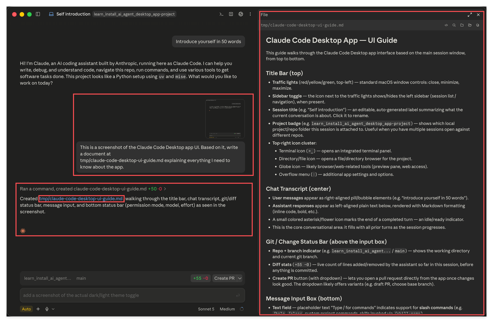

左边聊天区先是一行灰字 **Ran a command, created claude-code-desktop-ui-guide.md +50 -0**, 点开能看它具体做了什么. 下面一句话说明创建了 `tmp/claude-code-desktop-ui-guide.md`, 文件名是可以点的蓝色链接.

**点那个链接**, 右边就分屏打开一个 **File** 面板, 直接把 markdown 渲染成排好版的样子给你看, 上面还标着文件路径.

这是个很关键的习惯: **AI 改完东西, 你要看一眼.** 它写得再快, 最后为结果负责的还是你.

除了点链接, 还有一个完整的文件浏览器. 点标题栏最右边那个 **竖三点**:

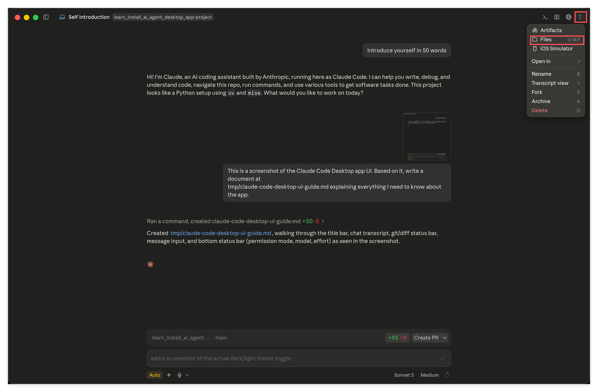

菜单里东西不少: **Artifacts**, **Files** (快捷键 Shift 加 Cmd 加 F), **iOS Simulator**, **Open in**, **Rename**, **Transcript view**, **Fork**, **Archive**, **Delete**.

先选 **Files**. 顺便记住这里也有一个 **Fork**, 第 15 小节要用.

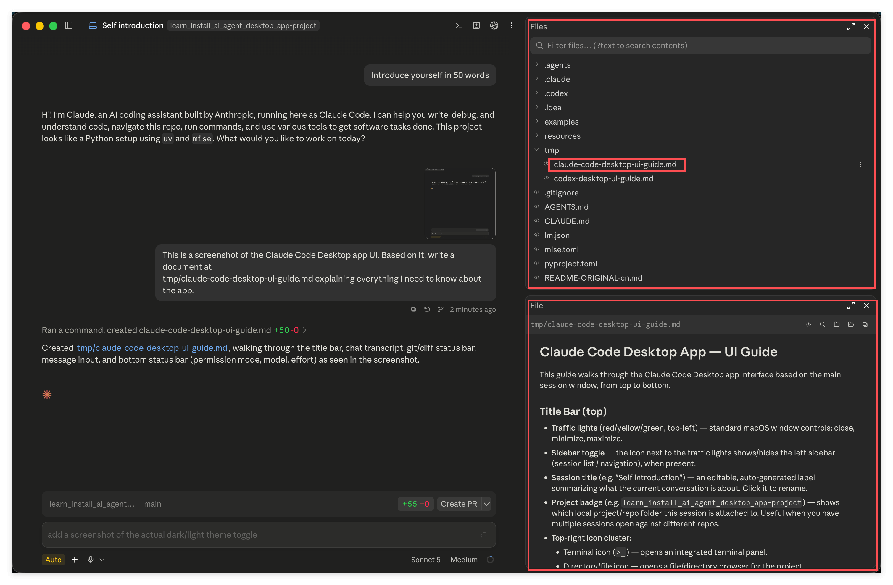

右上角就出来了完整的文件树: `.claude`, `examples`, `resources`, `tmp`, 以及根目录下的各种文件. 展开 `tmp` 就能看到刚才生成的那份文档. 上面还有一个搜索框, 能按文件名过滤, 也能搜文件内容.

点任何一个文件, 下面的 **File** 面板就会显示它的内容, markdown 会直接渲染出来.

所以整个流程你都不用离开这个 App: 交代任务, 看它干活, 审阅改动, 浏览文件, 提 PR, 全在一个窗口里.

### 12. 用一个 Agent Skill 干活

现在来兑现第 02 篇埋下的那个伏笔: 亲手用一次 **Agent Skill**.

我们要做的事很朴素: 这个仓库的 `resources/` 下面放了一篇官方讲 Agent Skill 的长文 `claude-agent-skills.md`, 我们让 AI 把它摘要一下.

**先召唤 skill.** 在输入框里打一个斜杠 `/`, 再打名字的前几个字母:

我打的是 `/summari`, 下面就浮出了候选项 **summarize**, 鼠标停上去还会显示它的完整描述, 末尾标着 **(project)**, 意思是这个 skill 来自当前这个项目. 按 Tab 或者直接点它就能补全.

**然后把那篇长文交给它.** 在右边文件树里找到 `resources/claude-agent-skills.md`, 右键:

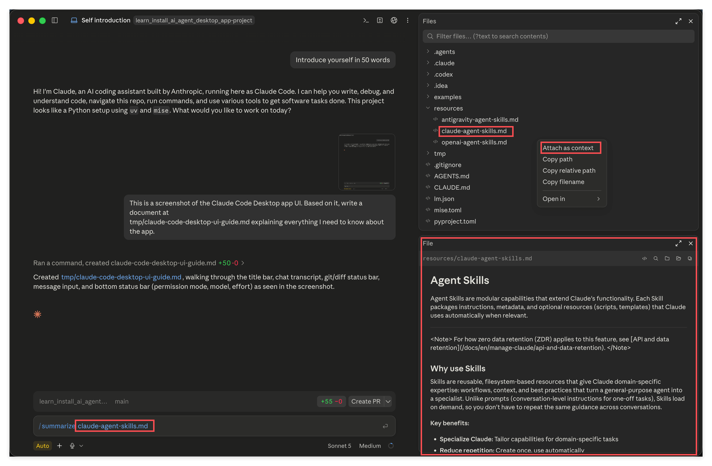

菜单里有 **Attach as context**, **Copy path**, **Copy relative path**, **Copy filename**, **Open in**:

- **Attach as context**: 直接把这个文件挂进输入框.
- **Copy path** 和 **Copy relative path**: 复制路径, 你自己粘进去.

这就是**第二种把材料交给 AI 的方式**. 加上前面的粘贴截图和直接给路径, 你现在手上有三种. 直接给路径当然最灵活, 但对人来说, 右键点两下显然更方便. 哪种顺手用哪种.

挂上之后, 输入框里就变成了 `/summarize claude-agent-skills.md`.

**顺便看看这个 skill 的真身.** 在文件树里展开 `.claude` > `skills` > `summarize`:

就一个 `SKILL.md`. 下面的 File 面板把它的内容显示出来了: 上面是 **Name** 和 **Description** 两个字段, 下面是 **Instructions** 正文, 一步步写清楚了这个 "摘要专家" 该怎么工作 (怎么判断输入是网址, 文件路径还是纯文本, 输出该是什么结构, 有哪些质量要求).

**你看它的路径就明白了: 一个 Agent Skill 本质上就是一个定义了这项能力的文件.** 第 02 篇说过 Skill 还可以打包参考资料, 脚本, 工具等等, 那都是真的, 但这个例子为了极简, 就只有这一个文件.

**发送, 看结果.**

上面那条消息显示成 `/summarize @resources/claude-agent-skills.md`, 下面就是输出, 结构长这样: **Source** 一行标明来源, **(1 sentence)** 一句话总括, **Key points** 若干条要点, **Notable details** 补充细节.

停下来品一下这件事的关键: **我全程没有交代过任何格式要求.** 我没说要一句话总括, 没说要列要点, 没说要标来源. 但输出严格按照这个结构来了, 因为这些全都写在 `SKILL.md` 里.

这就是第 02 篇说的 "造一个专家". 你把 "该怎么做摘要" 这件事想清楚一次, 打包成一个 Skill, 之后每一次摘要都自动是这个水准, 不用再交代第二遍.

### 13. Session 和上下文, 一个必须建立的概念

这一小节没有截图, 但它是整篇里最需要你真正理解的部分. 前面那些按钮你点几次就熟了, 这一节的东西不理解, 你会一直觉得 AI "有时候聪明有时候犯傻", 却始终找不到原因.

**先说 session.** 一个 session 就是一串连续的对话, 从你点 **New** 那一刻开始, 到你不再往下聊为止. 标题栏上那个名字 (图里是 Self introduction) 就是这个 session 的名字, 左侧栏的 Sessions 列表里列的也是它们. 我们前面做的所有事 (自我介绍, 截图写文档, 摘要长文) 全都发生在同一个 session 里, 所以它一直记得前面发生过什么.

**再说上下文.** 一来一回的本质是**一条条 message 在累积**. 你每发一次消息, 它并不是只看你这一句, 而是把这个 session 里迄今为止的全部内容重新过一遍, 然后才回答你. 这个 "全部内容" 就是上下文, 而它是有容量上限的.

现在讲这一节最关键, 也是最容易被忽略的一件事.

**上下文里装的, 远不止你在聊天记录里看到的那些字.**

你在屏幕上看到的是什么? 你的几句话, 它的几段回答. 看起来没多少. 但真正堆在上下文里的还有一大堆你**根本没看见** 的东西:

- **它读过的文件的全文.** 你让它摘要那篇长文, 全文都进了上下文, 而聊天记录里只显示了一行 Source.
- **它中间步骤的产物.** 它为了完成一件事, 可能先搜了目录, 列了文件, 试着读了几个不相干的文件才找对地方. 这些动作和它们的返回结果全都在上下文里, 但界面上往往只折叠成一行灰字.
- **系统提示词和工具说明.** 这套 Agent 本身要能干活, 就得先告诉模型 "你有哪些工具, 每个工具怎么用". 这一大段你一个字都看不到, 但它一直在那儿占着地方.
- **Agent Skill 的清单与全文.** 你装的每一个 skill, 它的名字和描述都要先加载进来, 模型才知道有这么个专家可以叫; 而你真的召唤了某一个, 那份 `SKILL.md` 的全文还会整篇塞进去. 你只看到一个小小的 summarize 标记, 但底下是整整一篇指令.

所以千万别有这种幻想: **界面上没显示, 就当它不存在.** 它存在, 它一样在吃你的上下文, 而且往往吃掉的是大头.

好消息是, 这件事在这个 App 里**不需要你猜**, 下一小节我们直接把它拆开给你看. 那张图会比这一整段文字都有说服力.

**那满了怎么办?** AI Agent 都会**自动压缩**, 把前面的历史压成更短的摘要, 腾出地方继续聊. 所以你感觉上是可以一直聊下去的, 不会突然被打断.

但你要知道压缩的代价: **压缩是有损的, 而且它并不知道哪一句对你最重要.** 它按自己的判断取舍, 完全可能把你最在意的那个细节压没了. 你后面再问, 它就答得含含糊糊, 或者干脆记错了. 很多人说的 "聊着聊着它就变笨了", 十有八九就是这么来的.

所以核心认知就一句: **它们的注意力不是无限的.**

由此推出一个必须养成的常规操作: **把重要的信息和结论写进文件, 要用的时候再让它读回来.**

这个动作的意义, 值得你想清楚: 上下文是易失的, 有上限的, 会被悄悄压缩的; 文件是稳定的, 无上限的, 你说删才删的. **上下文不是记忆, 文件才是记忆.** 你和它聊出来的好东西, 留在对话里就是易碎品, 写进文件才算真的存下来了. 下次要用, 一句话让它读进来就行, 而且读进来的是完整的原文, 不是被压缩过的残影.

这也正是第 02 篇为什么把 GitHub 列成硬前置: 你得有个地方装这些东西, 而且装得住, 找得回, 改得动.

### 14. 两个地方看上下文和额度

概念清楚了, 现在来看仪表盘. 这个 App 给了你两个入口, 一浅一深.

**浅的那个: 输入框右下角的小圆圈.** 就是第 2 小节我们跳过的那个. 鼠标停上去或者点一下:

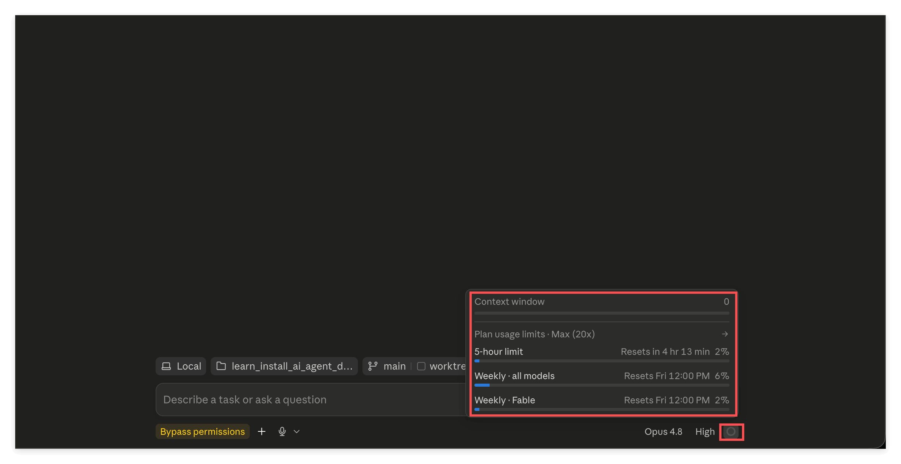

最上面一行是 **Context window**, 下面是 **Plan usage limits**, 再往下三行分别是 **5-hour limit** (几小时后重置), **Weekly · all models** (周五重置), **Weekly · Fable** (单独一行). 每一行右边都有百分比和进度条.

这就是第 8 小节说的那件事: **Fable 的额度单独计.** 这里看得清清楚楚.

换一个用了一阵子的会话再看一眼, 数字就有意思了:

Context window 显示 **75.1k / 967.0k (8%)**. 回想一下这个 session 里其实没聊几句, 但已经吃掉七万多. 你现在应该不会对这个数字感到意外了.

**深的那个: `/context` 命令.** 在输入框打一个斜杠加上 `conte`:

候选里浮出 **context**, 鼠标停上去提示 Show current context usage. 下面还有 compact, legal:brief, summarize 等等 . 也就是说斜杠命令不只用来召唤 skill, 也有一批内置命令.

选 context, 回车:

**这张图请你多看两眼, 它是上一小节那段话的直接证据.**

总量是 108.0k / 967.0k (11%), 下面一条一条拆开:

| 项目 | 占用 |
| --- | --- |
| Messages (你能看到的聊天记录) | 29.7k |
| System tools (工具说明) | 17.9k |
| System prompt (系统提示词) | 10.5k |
| Skills (skill 清单) | 8.4k |
| MCP tools | 8.3k |
| Memory files | 180 |
| Autocompact buffer (给自动压缩预留的空间) | 33.0k |
| Free space (还空着的) | 858.9k |

看出来了吗? **你在屏幕上能看到的那部分 (Messages) 只占 29.7k, 而已经用掉的是 108.0k.** 也就是说, 你看得见的还不到三成, 剩下七成全是你看不见但确实在占地方的东西.

这就是上一小节那句话的实锤: 界面上没显示, 不等于它不存在.

顺带解释一下 **Autocompact buffer** 这一项. 它是系统给自动压缩预留的缓冲区, 也就是说那 33k 已经被提前占住了, 不是给你聊天用的. 知道有这么回事就行.

什么时候该看这两个面板? 养成两个习惯就够: **一是每当你觉得它开始答得不如刚才准了, 先来看一眼是不是上下文快满了**; 二是准备开始一件新的正事之前看一眼, 剩得不多就先开个新会话, 别在一个已经很挤的 session 里硬撑. 额度同理, 快见底了就回头把模型换成更省的, 或者把 Effort 往 Faster 那边拉, 这两个旋钮你现在都会用了.

### 15. Fork, 保住一份干净的上下文

最后一个功能, 也是个很实用的功能.

先看场景: 你正在一件正事上聊得好好的, 上下文很干净. 突然你想问点别的, 一个跟当前这件事无关的问题. 直接问吧, 这段 "别的" 就把上下文占掉了一块; 不问吧, 又憋得慌.

**Fork 就是解法.**

鼠标停到某一条消息上, 下面会浮出一排小图标, 中间那个分叉形状的就是 fork, 提示写着 **Fork from here**:

图里标了 1, 2, 3 三条消息, 我在第 3 条上点了 fork. (前面第 11 小节那个竖三点菜单里也有一个 Fork, 效果一样, 两个入口都行.)

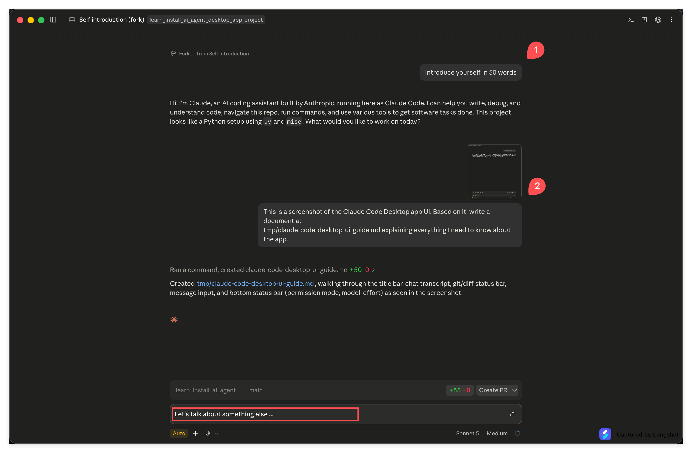

新会话的标题变成了 **Self introduction (fork)**, 顶上有一条 **Forked from Self introduction** 的标记. **注意看: 只剩下第 1 条和第 2 条, 那次 summarize 不见了.** 因为我是从第 3 条那里岔出来的, 它只把岔口之前的历史带了过来.

所以那个场景的完整走法是: 先把 "聊点别的" 那段的结论**写进文件**, 然后回到岔开之前的那条消息, **fork 一个新的出去**, 带着干净的上下文继续干正事.

fork 还有一个更值得学的用法: **一次性把需要的背景资料全部喂给 AI, 让它读完, 然后告诉它 "读完待命".** 从这个读满了资料的 session 出发, fork 出好几个分支, 每个分支去探索一个不同的方向. 这样每个分支都自带全部背景, 而你只喂了一次. 省下来的是时间, 也是额度.

---

## 6. 回顾: 把知识点串一遍

从头捋一遍你刚才走过的路.

**进门的两步**: 左上角从 Home 切到 Code, 这是从 ChatBot 那层壳换到 Agent 这层壳. 然后选定 clone 到本地的那个文件夹, 给它一块地盘.

**输入框周围的三个开关**, 这是日常影响最大的三个:

| 开关 | 你要记住的 |
| --- | --- |
| 权限模式 | Auto 是日常首选; Manual 适合刚上手时看清楚它在干嘛; Plan 用来先出方案再动手, 值得专门记住; Bypass permissions 只给能为损失兜底的专业用户 |
| Model | Sonnet 5 是默认也最常用, Opus 5 是旗舰留给硬骨头, Haiku 4.5 最轻最快, Fable 5 额度单独计. 菜单最底下的 Fast mode 只买速度不买聪明 |
| Effort | 滑块两端写着 Faster 和 Smarter, 已经把取舍说明白了. 不是越高越好, 越高越费. 消化信息靠 Faster 端, 交叉分析和写代码用中间, 复杂模糊无标准答案的问题才往 Smarter 端拉 |

另外几个小的: **Local** 决定活儿在哪儿干 (新手固定 Local), **main 和 worktree** 决定在哪个分支上干, **加文件夹** 按钮用来跨两个仓库干活, **加号菜单** 是给它材料和管理插件的总入口.

**三种把材料交给 AI 的方式**: 直接粘贴截图, 直接给文件路径, 文件树里右键 Attach as context. 路径最灵活, 右键最顺手.

**一个能用一辈子的方法**: 不知道某个软件怎么用, 截图丢给 AI 直接问; 它讲的跟你看到的对不上, 再截一张追问, 顺便让它联网搜. 这条对任何软件都成立.

**让它写文件时**, 明确指定路径, 相对路径和绝对路径都行. 临时产出往 `tmp/` 放, 那里被 gitignore 了.

**改完要看**: 点聊天记录里的文件链接直接看渲染结果, 竖三点菜单里的 Files 打开完整文件树. 提 PR 在输入框正上方那一条.

**Agent Skill**: 用 `/` 加名字模糊搜索, Tab 补全, 后面接材料就行. 它的真身就是一个文件 (`.claude/skills/summarize/SKILL.md`), 里面写清楚了这个专家该怎么工作. 它的价值是: 你把 "该怎么做这类事" 想清楚一次, 之后每次都是这个水准.

**Session 与上下文**: 一串对话就是一个 session, message 不断累积, 窗口有上限. 最要紧的一点是, **上下文里装的远不止你看得见的那几句话**. 这一点不用猜, `/context` 直接拆给你看: Messages 只占 29.7k, 而总共用掉了 108.0k, 剩下七成是系统提示词, 工具说明, skill 清单, 读过的文件和中间步骤. 满了它会自动压缩, 于是你能一直聊下去, 但压缩有损, 而且它不知道哪句对你重要. 所以把重要结论写进文件: 上下文不是记忆, 文件才是.

**Fork**: 从某一条消息岔出一个新会话, 只继承岔口之前的历史. 用来保住干净的上下文, 也用来从一份读满资料的 session 分头探索.

---

## 7. 练习

### 练习: 把这二十四张截图全部走一遍

**目标:** 上面每一个操作, 你自己动手做一遍. 做完这一遍, 这个 App 就算是你的了.

**怎么做:**

1. 把这个教学仓库 clone 到你本地.
2. 打开 Claude 桌面客户端, 左上角从 Home 切到 Code.
3. 点文件夹按钮, 用 Open folder 选中刚才 clone 下来的那个文件夹.
4. 发出第一条消息 (Introduce yourself in 50 words 就行), 确认整条链路是通的.
5. 把 Local, main, 加文件夹, 权限模式, 加号菜单, Model, Effort 这七个地方挨个点开看一遍. 把权限模式设成 Auto.
6. 把 Claude Code 这个界面本身截个图, 粘进输入框, 让它根据这张图写一份文档到 `tmp/` 下面某个 `.md` 文件里.
7. 等它写完, 点聊天记录里那个文件链接看渲染结果. 再用竖三点菜单打开 Files, 在文件树里找到这个文件.
8. 读一遍它写的这份文档, 挑一处跟你实际看到的界面对不上的地方, **再截一张图追问它, 并让它联网搜一下**. 看它怎么修正自己.
9. 在文件树里找到 `resources/claude-agent-skills.md`, 右键 Attach as context.
10. 输入 `/summari`, 按 Tab 补全, 发送. 看它的输出结构.
11. 输入 `/context`, 把那张拆解表从头看到尾, 特别注意 Messages 那一行占了多少, 总共用掉了多少.
12. 挑中间任意一条消息, 点 Fork from here, 确认新会话只继承到岔口之前.

**你会观察到:**

第 10 步的输出会严格按照一个你从没交代过的结构来. 第 11 步你会发现你看得见的聊天记录只占用掉总量的一小部分, 剩下的全是你从没注意过的东西. 第 12 步 fork 出来的新会话里, 后面那几条消息确实不见了.

这三个观察分别对应 Agent Skill, 上下文的真实构成, 以及上下文管理这三件事. 亲眼看到比读十遍都管用.

> **关键洞见:** 这些按钮你不需要背, 点过一遍就记住了. 真正需要你带走的是三件事: 看不懂就截图问 AI, Skill 是把一类事的做法固化下来, 上下文是一种要省着花的资源而文件才是真正的记忆.

---

## 8. 导师寄语

**为什么这一篇重要:**

我见过太多人装完工具就停在那儿了. 打开一看满屏按钮, 不知道从哪儿下手, 于是随手问了两句 "你好你是谁", 关掉, 然后再也没打开过. 工具没有问题, 卡住他们的是那种 "我不知道这些东西是干嘛的" 的茫然.

这一篇之所以写得这么长, 就是为了让你不必经历那种茫然. 二十几张图, 每一张都是你迟早会点到的地方. 你现在花一个小时全点一遍, 换来的是往后几百个小时不再犹豫.

**关键洞见:**

- **Effort 那一节值得你回头再读一遍.** 新手最常见的浪费不是问得太多, 而是给简单任务开了过高的档位. 便宜地把事做成, 是一种真本事.
- **`/context` 那张拆解表是这一篇最值钱的一张图.** 它把一件本来只能靠说的事变成了看得见的数字. 记住那个比例: 你看得见的不到三成.
- **Skill 才是你真正该往深里走的方向.** 界面上的按钮是死的, 点几次就熟了; 但 "把一类事的做法固化成一个专家" 这件事没有上限, 你走多远, 后面的路就有多宽.

**下一步:**

带着这个 App 去做点真事. 回头翻出你在第 02 篇练习里写下的那三件事, 挑最想动手的那一件, 开一个新会话, 就在这个 repo 里做起来. 做的过程中你会自然地用到今天学的每一样东西: 给它材料, 让它写文件, 审阅改动, 遇到跑题就 fork, 快满了就把结论存进文件.

到那时候, 这门课对你的意义才真正兑现.
