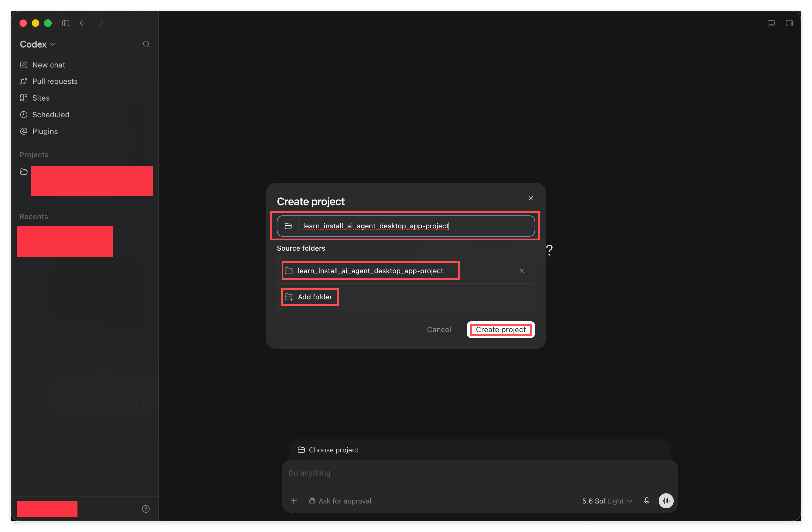
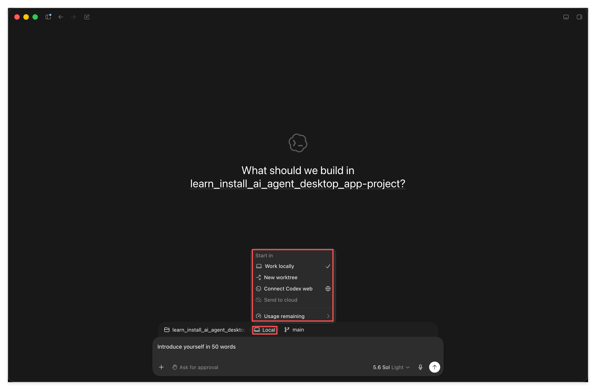
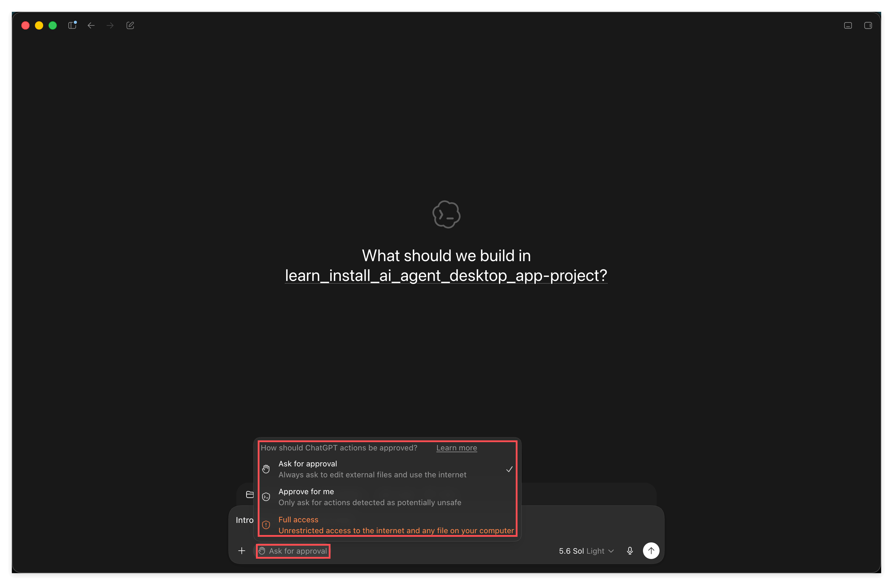
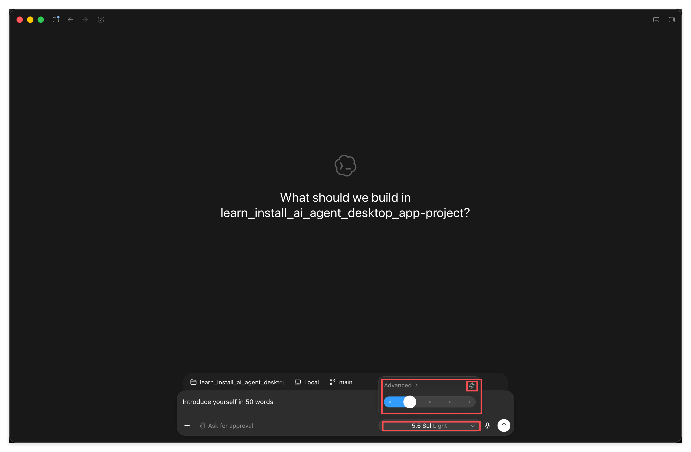
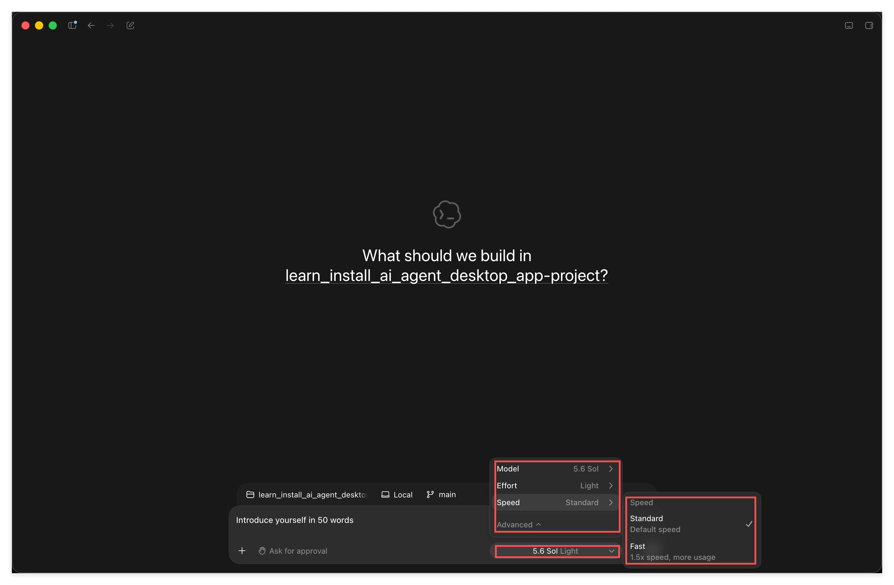
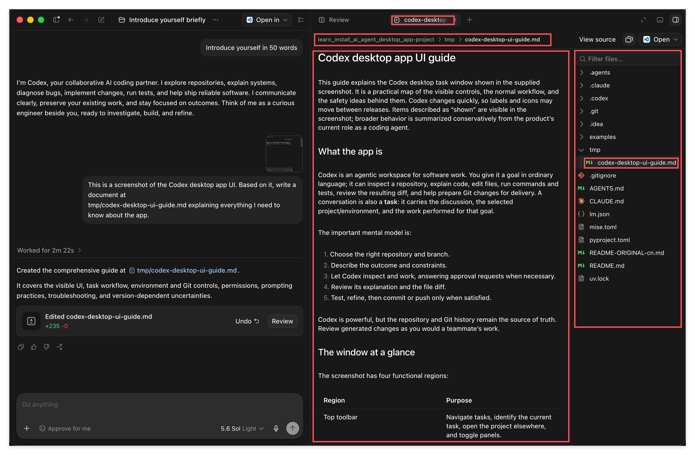
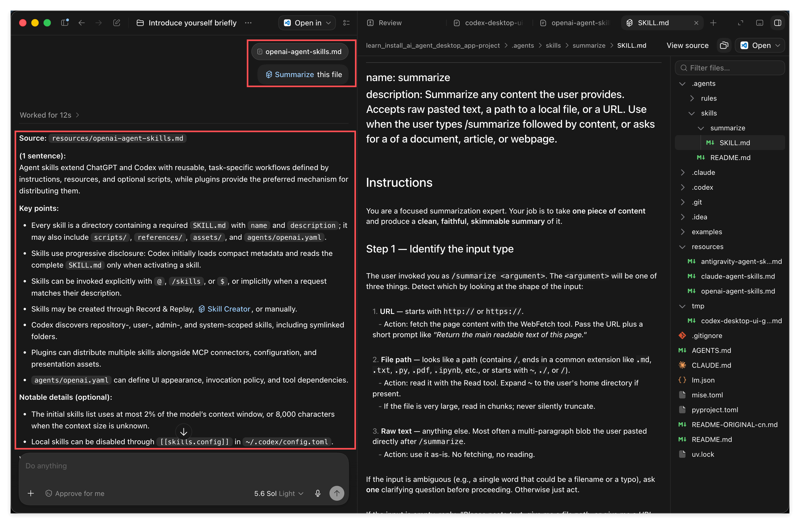
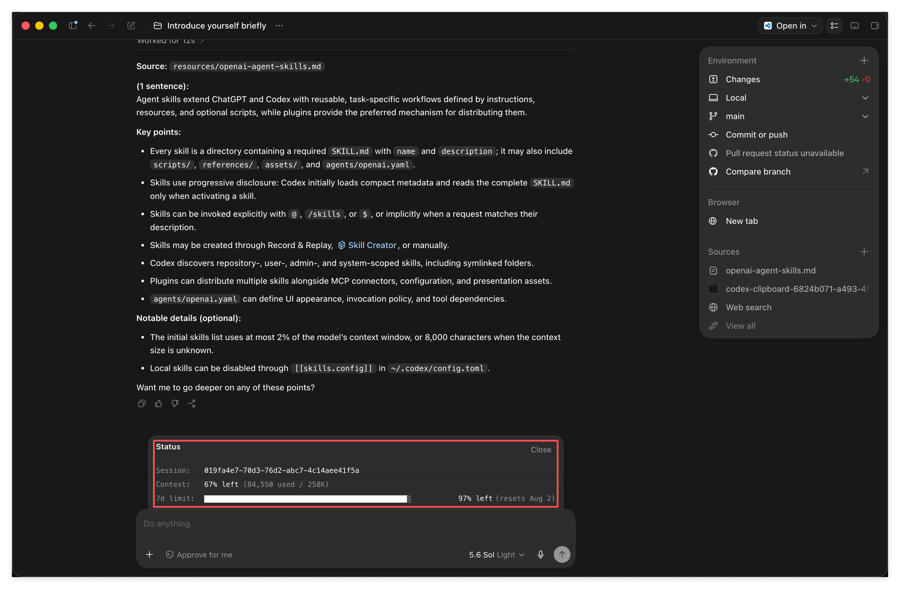
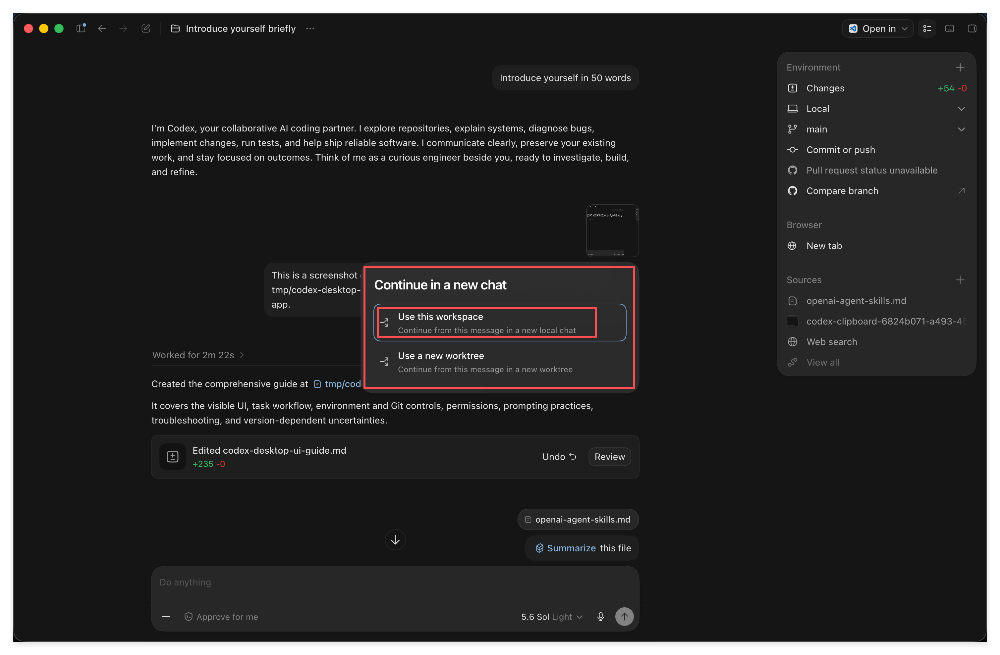

# Codex Desktop 上手, 从添加项目到用上第一个 Agent Skill

> 一篇走完 Codex 桌面版: 装好之后到底怎么用.

## 1. 概览

先打个招呼: **这一篇很长.**

原因很简单, 这门课把一款工具的全部内容都塞在一篇里, 不拆成七零八落的小节. 你不用在十几个目录之间来回跳, 从头顺着读下来就行. 截图有二十几张, 每一张对应一个具体的操作, 你完全可以一边开着 Codex 一边照着做.

读的时候别有压力. 真正需要你记住的东西不多, 大部分是 "看一眼就知道那个按钮是干嘛的". 剩下的边用边熟.

这一篇只讲 **Desktop 桌面版**, 不讲命令行. 截图是在 macOS 上截的, Windows 上布局大同小异, 按钮位置和名字基本一致.

---

## 2. 学习目标

装好一个工具和会用一个工具, 中间隔着一条不小的沟. 很多人装完之后打开一看, 满屏按钮不知道点哪个, 于是随便问了两句就关掉了, 从此束之高阁.

这一篇要做的就是把这条沟填平. 走完之后, 界面上每一个你会碰到的东西你都认识, 并且你已经用它真真正正做完了两件事: 让它读一张截图写出一份文档, 以及召唤一个 Agent Skill 帮你把一篇长文压成摘要.

学完这个 Task, 你将能够:

1. 在 Codex Desktop 里添加你自己的项目, 并看懂输入框周围每一个 widget 的含义, 尤其是审批模式, 模型, Effort 和 Speed 这四个真正影响体验的选项.
2. 用截图, 文件路径和右键挂载三种方式把材料交给 AI, 让它把产出写到你指定的位置, 并在不离开 App 的情况下审阅改动.
3. 召唤一个 Agent Skill 完成一次真实任务, 看懂上下文窗口与额度, 并用 fork 保住一份干净的上下文.

---

## 3. 前置知识

- 读过第 01, 02, 03 篇, 已经选定 Codex, 并且账号能正常登录发消息.
- 会 GitHub 的基本操作: 创建 repo, clone 到本地, commit 与 push. 这一篇的第一步就要用到 clone.
- 已经装好了 ChatGPT 的桌面客户端. Codex 就住在这个客户端里面, 不需要单独再装一个软件.
- 不需要任何编程经验.

---

## 4. 你将学到什么

一套完整的 Codex Desktop 操作手感, 外加两份真实产出: 一份由 AI 根据截图写出来的说明文档, 和一份由 Agent Skill 生成的长文摘要. 两份都会落在你自己的 repo 里.

---

## 5. 跟着截图走一遍

下面每一小节对应一张或几张截图. 建议你把 Codex 打开放在旁边, 一边看一边做.

### 1. 先切换到 Codex

打开 ChatGPT 桌面客户端, 看左上角, 那里有一个 **ChatGPT** 加一个下拉箭头. 点它.

菜单里有两项:

- **ChatGPT**, 副标题 Create, learn, and explore. 这就是你平时聊天的那个模式.
- **Codex**, 副标题 Build, debug, and ship. 这是干活的模式.

选 **Codex**.

这里正好印证第 02 篇讲过的骨架: 同一个大脑, 外面套了两层不同的壳. ChatGPT 那一层是 ChatBot, 你问一句它答一句; Codex 这一层是 Agent, 它能读你的文件, 改你的文件, 自己一步步把事情做完. 切换的这一下, 你就是在换壳.

### 2. 把你的项目添加进来

切过来之后, 界面变了. 左侧栏是 New chat, Pull requests, Sites, Scheduled, Plugins, 下面是 Projects 和 Recents. 中间大字写着 What should we build?

**动手之前先做一件事: 把这个教学仓库 clone 到你本地.** Codex 干活是要有一个文件夹作为地盘的, 没有地盘它无从下手. 这就是第 01 篇说的 "一件事就是一个文件夹, 这个文件夹就是一个 repo".

clone 好之后, 点输入框上方的 **Choose project**, 会弹出一个小面板, 里面有搜索框, **New project** 和 **Choose project** 两个选项. 点 **New project**.

弹出 Create project 对话框, 两件事:

- 上面填**项目名字**. 图里填的是 learn_install_ai_agent_desktop_app-project.
- 下面 **Source folders** 选你刚才 clone 下来的那个文件夹. 注意这里有个 **Add folder**, 意思是一个 project 可以挂多个文件夹. 现在用不上, 知道有这回事就行.

填好点 **Create project**.

创建完成后你会看到三处变化: 左侧 Projects 下面多了这个项目; 中间的大字变成了 What should we build in learn_install_ai_agent_desktop_app-project; 输入框上方多出三个小按钮, 分别是**项目名**, **Local**, **main**.

接下来的四小节就是把这三个按钮, 以及输入框底部那一排, 一个一个讲清楚.

图里我在输入框打了一句 Introduce yourself in 50 words, 你也可以照着打. 这是最省事的第一条消息, 用来确认整条链路是通的.

### 3. Local, 决定这活儿在哪儿干

点输入框上方的 **Local**.

菜单标题是 Start in, 意思是这次任务从哪儿起步:

- **Work locally**: 直接在你本地那个文件夹里干活.
- **New worktree**: 开一份独立的工作副本.
- **Connect Codex web** 和 **Send to cloud**: 把活儿丢到云端去跑.
- **Usage remaining**: 看你的额度还剩多少.

**什么时候用哪个?** 你的答案在很长一段时间里都是 **Work locally**, 它也是默认值. 它的意思是 AI 直接在你眼皮底下, 在你那个真实的文件夹里改东西. 好处是所见即所得, 它改完你立刻能在 Finder 或者编辑器里看到; 坏处是它改错了就是真改错了, 所以才需要下一节讲的审批模式给你兜着.

**New worktree** 解决的是另一个问题: 你想同时推进两三件互不相干的事, 又不希望它们改到同一份文件上打架. worktree 就是给同一个仓库开出几份互相隔离的工作副本, 各干各的, 谁也不碍着谁. 这是个很好用的进阶功能, 但前提是你已经对 git 比较熟了. 现阶段知道有这么回事就够, 不用碰.

**Connect Codex web** 和 **Send to cloud** 是把任务丢到 OpenAI 那边的机器上跑, 不占用你自己的电脑. 适合那种要跑很久, 你又想合上笔记本走人的活儿. 同样先不管, 等你哪天真遇到 "这个任务跑半小时我不想守着" 的场景, 再回来点它.

**Usage remaining** 值得你现在就记住位置. 第 03 篇说过免费额度很快就见底, 想知道自己还剩多少, 这里是最快的一个入口. 养成习惯: 感觉它开始变慢或者报错的时候, 先来这儿看一眼是不是额度的问题, 别瞎猜.

### 4. main, 决定在哪个分支上干

点 **main**.

这是 git 分支选择器: 上面能搜, 中间列出所有分支, 最下面是 **Create and checkout new branch**, 可以直接新建并切过去.

**什么时候用它?** 新手阶段, 待在 **main** 上就行, 你可以整篇跳过这一段. 但有一个场景你迟早会遇到: 你打算让 AI 做一件动静比较大的事, 心里没底, 又不想把主线搞乱. 这时候在这里新建一个分支, 让它在新分支上折腾, 满意就合回去, 不满意就把分支扔掉, 主线一点没脏. 这是 git 给你的后悔药, 而这个按钮让你不用切出去敲命令就能吃到.

顺便注意 main 下面那行小字 **Uncommitted: 1 file**, 它告诉你当前有几个文件改了还没提交. 这个小细节比看上去有用: AI 干活很快, 一轮下来可能动了七八个文件, 这行数字就是你的提醒器, 省得你干完活忘了自己动过什么, 更省得你在一堆未提交的改动上又叠一堆新的.

这里再强调一遍第 01 篇那个前置的意义. 分支, 提交, 推送这些概念不是给程序员准备的仪式感, 它们是你和 AI 一起干活时唯一可靠的后悔机制. 你要是完全不懂 git, 这个按钮对你就只是个装饰; 懂一点, 它就是安全带.

### 5. 审批模式, 这是最重要的一个开关

点输入框左下角那个 **Ask for approval**.

弹出的标题是 How should ChatGPT actions be approved, 三个档位:

- **Ask for approval**: Always ask to edit external files and use the internet. 最严格, 它想改文件, 想上网, 每次都得问过你.
- **Approve for me**: Only ask for actions detected as potentially unsafe. 它自己判断, 只有被认为可能不安全的动作才来问你.
- **Full access**: Unrestricted access to the internet and any file on your computer. 完全放开, 不问了.

怎么选? 给你一个实话实说的分布:

**Approve for me 是绝大多数人的选择, 七成以上的用户用它.** 它在 "别烦我" 和 "别出事" 之间找到了一个很舒服的平衡点, 也是我推荐你日常用的档位.

**Ask for approval 比较严格**, 好处是每一步你都清楚它要干什么. 刚上手的头几天可以用它, 顺便看看 Agent 到底会做哪些动作, 心里有个数. 缺点是问得太勤, 用久了会烦.

**Full access 是给专业用户的**, 而且有个前提: 你得能为自己的损失兜底, 搞砸了认栽. 它能不经询问动你电脑上任何一个文件. 除非你非常清楚自己在干什么, 否则别碰.

**什么时候切换?** 给一个很实际的节奏: 头几天用 Ask for approval 看清楚它的动作模式, 心里有数了就长期停在 Approve for me. 之后只有一种情况值得临时调整, 就是你要让它做一件步骤特别多的活儿 (比如一口气整理几十个文件), 又已经确认这个仓库里没有任何要紧东西丢不起. 那时候可以临时放宽, 干完再调回来.

还有一条经验: **审批模式和后悔机制是配套的.** 你把审批放得越松, 上一节那个分支就越该用起来. 两者一起用, 你既不用被问得心烦, 又随时能整段退回去.

### 6. 打开模型设置面板

看输入框右下角, 那里写着 **5.6 Sol Light**. 点它.

跳出来一个小面板, 里面有一个 **Advanced** 加一个四档滑块.

先说这个滑块. 它是快速调节用的, 拖一下就换档, 不用展开菜单. 它调的是下面要讲的 **Effort** (思考强度), 也就是三个选项里你最常改的那一个. 设计成滑块就是这个意思: 这是个高频动作, 值得给它一个一步到位的入口.

想看全部选项, 点 **Advanced** 展开, 会看到三行: **Model**, **Effort**, **Speed**.

**先建立一个整体印象再往下看**, 这三个不是并列的三个开关, 它们管的是完全不同的三件事: **Model 决定你用哪个大脑, Effort 决定这个大脑肯花多少心思, Speed 决定它出结果多快.** 记住这个分工, 后面三小节就好懂了. 还有一点: 这三项随时可以改, 改完对**接下来发出的消息** 生效, 不影响已经说过的话. 所以不用怕点错, 点开看一圈, 试着换一换, 是这一步最好的学习方式.

### 7. Model, 选哪个大脑

点 **Model**.

列表里是 5.6 Sol, 5.6 Terra, 5.6 Luna, 以及下面的 5.5, 5.4, 5.4 Mini.

5.6 这一代的三个, 记住这三句话就够了:

- **Sol**: 旗舰. 最强的那个.
- **Terra**: 非常均衡, 也是最常用的那个. 拿不定主意就选它.
- **Luna**: 额度紧张时的选择. 如果你希望一直有的用, 不想动不动就撞额度墙, 就用这个.

**什么时候用哪个?** 默认停在 **Terra**. 它是那种绝大多数任务上你根本感觉不出比旗舰差在哪, 但明显更经花的档位. 日常的读文章, 整理资料, 写文档, 改东西, 它全都拿得下.

**Sol** 留给那种你真的觉得吃力的任务: 一个绕不过去的复杂问题, 一份怎么改都不满意的东西, 或者你需要它一次性给出高质量结果不想来回返工. 这种时候旗舰的差距才显得出来. 反过来, 拿 Sol 去读一篇文章做摘要, 你多花的额度买不到任何看得见的提升.

**Luna** 是省着用的档位. 什么时候切? 两种情况: 一是你这个月额度已经吃紧, 但手上还有一堆不那么重要的杂活要处理; 二是你要连续跑很多轮 (比如一口气整理二十个文件), 与其跑到一半没额度, 不如全程用它稳稳跑完. 记住第 02 篇那句话, 你花的钱买的是算力, 所以 "够用就好" 在这里是一个真实的省钱策略, 不是将就.

底下的 5.5, 5.4, 5.4 Mini 是上一代, 一般不用管. 唯一会用到的场景是你在某个新版本上遇到了怪问题, 想退回旧版本对比一下是不是新模型的锅.

### 8. Effort, 让它想多深

点 **Effort**.

五档: **Light**, **Medium**, **High**, **Extra High**, **Ultra**. 最后一档下面还专门标了一句 Consumes usage limits faster.

这里有个常见误解要先破掉: **不是调得越高越好.** 调高意味着它想得更久, 也意味着更费 token, 更费你的额度. 给一个不难的任务开 Ultra, 纯属浪费.

大致这么配:

- **读一篇文章讲给我听, 解读和消化信息** 这类事, **Light** 就够了. 它本来就不需要多深的推理.
- **多个文件交叉比对分析**, 或者**写代码**, **Medium** 基本够用.
- **很复杂的系统**, **边界模糊说不清楚的问题**, **没有标准答案的头脑风暴**, 才值得往 **High** 以上调.

实操上的建议: **从低往高试.** 先用低档跑一遍, 觉得它答得浅, 抓不住要害, 再往上调一档. 反过来一上来就顶到最高, 你既感觉不出差别, 额度还掉得飞快.

怎么判断该往上调? 有几个很明显的信号: 它给的答案正确但空洞, 全是正确的废话; 它漏掉了你觉得很关键的一个点; 或者它给了个方案, 但明显没考虑到某个你一眼就看到的坑. 这些都说明它想得不够深, 这时候调高一档往往立竿见影.

反过来也有信号说明你调太高了: 你等了很久, 拿到的东西跟低档给的差不多; 或者它在一个本来很直白的问题上绕来绕去, 想得太多反而跑偏. 这时候降回去.

**Ultra 那一档慎用.** 界面上专门给它标了 Consumes usage limits faster, 这句提示是有分量的. 除非你面对的确实是一个开放的, 没有标准答案的难题, 否则不值得.

### 9. Speed, 一个有点特殊的选项

点 **Speed**.

只有两档: **Standard** (Default speed) 和 **Fast** (1.5x speed, more usage).

这个选项跟前面两个不一样, 它比较特殊: **它不改变模型有多聪明, 只改变它出结果有多快.** Model 和 Effort 调的都是 "结果会不会更好", 而 Speed 调的是 "结果来得会不会更早". 你花额度买的纯粹是时间.

界面上写得很直白: Fast 是 1.5x speed, more usage. 快五成, 代价是更费额度. 注意这是一笔纯粹的交易, 没有任何附加价值, 同样的问题同样的答案, 只是早一点到你面前.

**什么时候值得买?** 一种是你正等着这个结果才能做下一步, 干坐着的每一分钟都是浪费, 比如临时被人催一份东西. 另一种是你在做那种需要来回试很多轮的活儿, 每轮都要等一会儿, 一轮省几十秒, 十几轮下来省的是你的注意力, 而注意力比额度贵.

**平时就用 Standard.** 尤其是当你把任务丢出去之后本来就打算去干别的, 那快这五成对你毫无意义, 纯属白花额度. 这也是我把它排在最后讲的原因: 三个选项里, 它是你最不需要动的那个.

### 10. 把截图给它, 让它把文件写到你指定的地方

widget 认完了, 开始干正事.

先交代一下这个对话是怎么起头的. 还记得第 2 小节我在输入框里打的那句 **Introduce yourself in 50 words** 吗? 它就是这次对话的第一条消息, 而且是我特意挑的.

为什么是这句? 因为它有三个好处: 它一定能答上来, 所以能确认整条链路是通的; 我限定了 **50 words**, 它答得飞快, 不浪费你的时间也不浪费额度; 而且它答完之后, 你顺手就看到了这个 App 完整的工作界面长什么样. 这是一条性价比极高的开场白, 你以后每次配好一个新工具, 都可以用类似的一句话来验货.

**然后关键的一步来了: 我看到它的回答之后, 直接把 Codex 这个界面本身截了个图, 丢回去问它.**

这一轮我做了两件事.

**第一, 把一张截图交给它.** 直接在输入框里粘贴 (Cmd+V) 就行, 图会作为附件挂在输入框上方.

顺带说一句, **你也可以直接把图片文件的路径打给它**, 效果一样. 路径这种方式其实更灵活, 只是粘贴对人来说更顺手. 这两条路你都留个印象, 后面还会用到.

这里要单独拎出来讲一个方法, 它比这一整节的操作细节都重要:

> **不知道怎么用一个软件? 截图, 丢给 AI, 直接问.** 这是最简单也最直白的一条路, 而且对任何软件都成立, 不只是 Codex.

这不是什么取巧, 这是这个时代最实在的学习方式之一. 以前你遇到一个陌生界面, 得去搜教程, 翻文档, 看视频, 而那些东西往往还跟你眼前这个版本对不上. 现在你直接把眼前看到的东西给它看, 让它就着你这一版界面讲给你听.

**而且要接着追问.** 你照着它说的点下去, 如果发现它讲的跟你实际看到的不一样 (这很常见, 软件更新得比模型的知识快), 别停在那儿, **再截一张图丢回去, 顺便让它联网搜一下**. 它会拿着最新的信息重新给你一个答案. 这样一来一回两三轮, 你对这个软件的掌握程度往往就超过大部分只看过教程的人了.

把这个习惯记牢: **看不懂就截图问, 对不上就再截图追问加联网.** 这一条你今天带走, 这门课就没白读.

**第二, 明确告诉它把结果写到哪里.** 我写的指令是:

> This is a screenshot of the Codex desktop app UI. Based on it, write a document at tmp/codex-desktop-ui-guide.md explaining everything I need to know about the app.

注意那个 `tmp/codex-desktop-ui-guide.md`, 这是**相对于项目根目录的相对路径**. 你也可以给**绝对路径**, 比如 `${HOME}/Documents/GitHub/your-repo/tmp/xxx.md`, 两种都认.

为什么选 `tmp/`? 因为这个仓库的 `.gitignore` 把 `tmp/` 忽略掉了, 它就是专门放临时产出的地方, 写进去不会污染你的 git 记录. 这是个好习惯: **让 AI 写文件时, 明确说清楚写到哪儿**, 别让它自己乱猜.

对了, 我这一轮把审批模式切成了 Approve for me, 不然它每写一个文件都要问你一次.

顺带看一眼右上角的 **Environment** 面板: Changes 显示 +54 -0, 下面还有 Local, main, **Commit or push**. 也就是说改完之后, 你不用切出去开终端, 在这儿就能提交推送. 第 01 篇要求你会 GitHub, 用处就在这里.

### 11. 不离开 App, 直接看它改了什么

它干完了.

左边聊天区告诉你 Worked for 2m 22s, 创建了 `tmp/codex-desktop-ui-guide.md`, 下面一张卡片写着 Edited codex-desktop-ui-guide.md **+235 -0**, 旁边两个按钮: **Undo** 和 **Review**.

点 **Review**, 右边就分屏打开 diff, 绿色的全是新增行. **Undo** 则是一键撤销, 后悔了随时能退回去.

这是个很关键的习惯: **AI 改完东西, 你要看一眼.** 它写得再快, 最后为结果负责的还是你.

除了聊天记录里的 Review, 还有一个内置的文件浏览器. 点右侧标签栏的 **+**:

菜单里有四项: **Terminal**, **Browser**, **Files**, **Side chat**. 选 **Files**.

右边就出来了完整的文件树, 点任何一个文件都能看内容, markdown 还会直接渲染成排好版的样子. 上方还有面包屑告诉你现在在哪个路径.

所以整个流程你都不用离开这个 App: 交代任务, 看它干活, 审阅改动, 浏览文件, 提交推送, 全在一个窗口里.

### 12. 用一个 Agent Skill 干活

现在来兑现第 01 篇埋下的那个伏笔: 亲手用一次 **Agent Skill**.

我们要做的事很朴素: 这个仓库的 `resources/` 下面放了一篇 OpenAI 官方讲 Agent Skill 的长文 `openai-agent-skills.md`, 我们让 AI 把它摘要一下.

**先把这篇长文交给 AI.** 这次换个方式, 在右边文件树里找到它, 右键:

菜单里有 **Copy path** 和 **Add to chat**:

- **Add to chat**: 直接把这个文件挂进输入框, 变成附件. 图里左下角那个 openai-agent-ski... MD 就是.
- **Copy path**: 复制路径, 你自己粘进去.

这就是**第二种把材料交给 AI 的方式**. 加上前面的粘贴截图和直接给路径, 你现在手上有三种. 直接给路径当然最灵活, 但对人来说, 右键点两下显然更方便. 哪种顺手用哪种.

**然后召唤 skill.** 在输入框里打一个斜杠 `/`, 再打 skill 名字的前几个字母:

我打的是 `/summari`, 上面就浮出了候选项 **Summarize**, 后面跟着它的描述和所属项目. 按 **Tab** 自动补全.

除了斜杠 `/`, 用 `$` 加名字也一样能召唤, 都是模糊搜索, 不用打全.

右边我顺手打开了这个 skill 的真身: `.agents/skills/summarize/SKILL.md`. **你看它的路径就明白了: 对 Codex 来说, 一个 Agent Skill 本质上就是一个定义了这项能力的文件.** 第 01 篇说过 Skill 还可以打包参考资料, 脚本, 工具等等, 那都是真的, 但这个例子为了极简, 就只有一个文件, 里面写清楚了这个 "摘要专家" 该怎么工作: 怎么判断输入是网址, 文件路径还是纯文本, 输出该是什么结构, 有哪些质量要求.

**补全之后, 后面接你的指令.**

补全后输入框变成 **Summarize** 这个 skill 标记, 后面我接了 this file. 整句读起来就是 "摘要这个文件", 而 this file 指的就是挂在上面的那个附件.

这里想强调一句: **召唤出 skill 之后, 你后面接任何话都行, AI 不傻, 它知道你想干什么.** 不用背什么固定格式.

**看结果.**

12 秒出结果, 结构长这样: **Source** 一行标明来源, **(1 sentence)** 一句话总括, **Key points** 七条要点, **Notable details** 补充细节.

停下来品一下这件事的关键: **我全程没有交代过任何格式要求.** 我没说要一句话总括, 没说要列七条, 没说要标来源. 但输出严格按照这个结构来了, 因为这些全都写在 `SKILL.md` 里.

这就是第 01 篇说的 "造一个专家". 你把 "该怎么做摘要" 这件事想清楚一次, 打包成一个 Skill, 之后每一次摘要都自动是这个水准, 不用再交代第二遍.

### 13. Session 和上下文, 一个必须建立的概念

这一小节没有截图, 但它是整篇里最需要你真正理解的部分. 前面那些按钮你点几次就熟了, 这一节的东西不理解, 你会一直觉得 AI "有时候聪明有时候犯傻", 却始终找不到原因.

**先说 session.** 一个 session 就是一串连续的对话, 从你点 **New chat** 那一刻开始, 到你不再往下聊为止. 我们前面做的所有事 (自我介绍, 截图写文档, 摘要长文) 全都发生在同一个 session 里, 所以它一直记得前面发生过什么, 你说 "this file" 它知道你指哪个.

**再说上下文.** 一来一回的本质是**一条条 message 在累积**. 你每发一次消息, 它并不是只看你这一句, 而是把这个 session 里迄今为止的全部内容重新过一遍, 然后才回答你. 这个 "全部内容" 就是上下文, 而它是有容量上限的.

现在讲这一节最关键, 也是最容易被忽略的一件事.

**上下文里装的, 远不止你在聊天记录里看到的那些字.**

你在屏幕上看到的是什么? 你的几句话, 它的几段回答. 看起来没多少. 但真正堆在上下文里的还有一大堆你**根本没看见** 的东西:

- **它读过的文件的全文.** 你让它摘要 `openai-agent-skills.md`, 那可是两百多行, 全都进了上下文, 而聊天记录里只显示了一行 "Source: resources/openai-agent-skills.md".
- **它中间步骤的产物.** 它为了完成一件事, 可能先搜了目录, 列了文件, 试着读了几个不相干的文件才找对地方. 这些动作和它们的返回结果全都在上下文里, 但界面上往往只折叠成一句 "Worked for 2m 22s".
- **Agent Skill 的内容.** 你召唤一个 skill, 那个 `SKILL.md` 的全文就被塞进去了. 你只看到一个小小的 Summarize 标记, 但底下是整整一篇指令.
- **它写出去的东西.** 它给你生成的那份 235 行的文档, 你看到的是一张 "Edited xxx +235 -0" 的卡片, 但那 235 行内容本身也是它产出的, 也占地方.

所以千万别有这种幻想: **界面上没显示, 就当它不存在.** 它存在, 它一样在吃你的上下文, 而且往往吃掉的是大头. 这就是为什么你明明只聊了十几句, 一看 Status 上下文却已经用掉三分之一.

**那满了怎么办?** AI Agent 都会**自动压缩**, 把前面的历史压成更短的摘要, 腾出地方继续聊. 所以你感觉上是可以一直聊下去的, 不会突然被打断.

但你要知道压缩的代价: **压缩是有损的, 而且它并不知道哪一句对你最重要.** 它按自己的判断取舍, 完全可能把你最在意的那个细节压没了. 你后面再问, 它就答得含含糊糊, 或者干脆记错了. 很多人说的 "聊着聊着它就变笨了", 十有八九就是这么来的.

所以核心认知就一句: **它们的注意力不是无限的.**

由此推出一个必须养成的常规操作: **把重要的信息和结论写进文件, 要用的时候再让它读回来.**

这个动作的意义, 值得你想清楚: 上下文是易失的, 有上限的, 会被悄悄压缩的; 文件是稳定的, 无上限的, 你说删才删的. **上下文不是记忆, 文件才是记忆.** 你和它聊出来的好东西, 留在对话里就是易碎品, 写进文件才算真的存下来了. 下次要用, 一句话让它读进来就行, 而且读进来的是完整的原文, 不是被压缩过的残影.

这也正是第 01 篇为什么把 GitHub 列成硬前置: 你得有个地方装这些东西, 而且装得住, 找得回, 改得动.

### 14. 用 status 看上下文和额度

概念清楚了, 现在来看仪表盘. 在输入框打 `/stat`:

浮出来的候选里, 上面是内置命令 **Status** (Show chat ID, context usage, and rate limits), 下面 Skills 分组里才是各种 skill.

也就是说斜杠命令不只用来召唤 skill, 也有一批内置命令. 选 Status.

三行信息:

- **Session**: 这次会话的 ID.
- **Context**: 67% left (84,550 used / 258K). 上下文窗口还剩多少.
- **7d limit**: 97% left (resets Aug 2). 七天的额度还剩多少, 以及什么时候重置.

**中间这行就是上一节讲的那个容量表.** 84,550 已经用掉, 总共 258K. 回想一下这个 session 里其实没聊几句, 但读进去的那篇长文, 那些中间步骤, 那个 SKILL.md, 加起来就是这个数. 你现在应该不会再对这个数字感到意外了.

什么时候该看它? 养成两个习惯就够: **一是每当你觉得它开始答得不如刚才准了, 先来看一眼是不是上下文快满了**; 二是准备开始一件新的正事之前看一眼, 剩得不多就先开个新对话, 别在一个已经很挤的 session 里硬撑.

最后一行的额度同理. 快见底了, 回头去把 Model 换成更省的, 或者把 Effort 调低一档, 这两个旋钮你现在都会用了.

### 15. Fork, 保住一份干净的上下文

最后一个功能, 也是个很实用的功能.

先看场景: 你正在一件正事上聊得好好的, 上下文很干净. 突然你想问点别的, 一个跟当前这件事无关的问题. 直接问吧, 这段 "别的" 就把上下文占掉了一块; 不问吧, 又憋得慌.

**Fork 就是解法.**

看每一条回答下面那一排小图标, 最右边那个分叉形状的就是 fork:

图里标了 1, 2, 3 三条消息. 我在第 2 条下面点了 fork.

弹出 Continue in a new chat, 两个选项:

- **Use this workspace**: 在同一个工作区里开一个新对话, 从这条消息接着往下.
- **Use a new worktree**: 开一份独立的工作副本再继续. 进阶用法, 先不管.

选 **Use this workspace**.

新对话叫 Introduce yourself briefly (2), 中间有一条 **Continued from chat** 的分隔标记. **注意看: 只保留到第 2 条为止的历史, 第 3 条 (那次 summarize) 不见了.** 因为我是从第 2 条 fork 出来的.

所以那个场景的完整走法是: 先把 "聊点别的" 那段的结论**写进文件**, 然后回到岔开之前的那条消息, **fork 一个新的出去**, 带着干净的上下文继续干正事.

fork 还有一个更值得学的用法: **一次性把需要的背景资料全部喂给 AI, 让它读完, 然后告诉它 "读完待命".** 从这个读满了资料的 session 出发, fork 出好几个分支, 每个分支去探索一个不同的方向. 这样每个分支都自带全部背景, 而你只喂了一次. 省下来的是时间, 也是额度.

---

## 6. 回顾, 把知识点串一遍

从头捋一遍你刚才走过的路.

**进门的两步**: 左上角把 ChatGPT 切成 Codex, 这是从 ChatBot 那层壳换到 Agent 这层壳. 然后把 clone 到本地的仓库添加成一个 project, 给它一块地盘.

**输入框周围的四个开关**, 这是日常影响最大的四个:

| 开关 | 你要记住的 |
| --- | --- |
| 审批模式 | Approve for me 是七成人的选择, 日常用它; Ask for approval 适合刚上手时看清楚它在干嘛; Full access 只给能为损失兜底的专业用户 |
| Model | Sol 是旗舰, Terra 均衡且最常用, Luna 省额度 |
| Effort | 不是越高越好, 越高越费. 消化信息用 Light, 交叉分析和写代码用 Medium, 复杂模糊无标准答案的问题才往 High 以上调 |
| Speed | 只买速度, 不买聪明. 平时 Standard, 赶时间才 Fast |

另外两个小的: **Local** 决定活儿在哪儿干 (新手固定 Work locally, 顺便记住 Usage remaining 在这儿看), **main** 决定在哪个分支上干.

**三种把材料交给 AI 的方式**: 直接粘贴截图, 直接给文件路径, 文件树里右键 Add to chat. 路径最灵活, 右键最顺手.

**一个能用一辈子的方法**: 不知道某个软件怎么用, 截图丢给 AI 直接问; 它讲的跟你看到的对不上, 再截一张追问, 顺便让它联网搜. 这条对任何软件都成立.

**让它写文件时**, 明确指定路径, 相对路径和绝对路径都行. 临时产出往 `tmp/` 放, 那里被 gitignore 了.

**改完要看**: 聊天记录里点 Review 看 diff, 后悔了点 Undo. 右侧 `+` 能开 Terminal, Browser, Files, Side chat, 文件浏览器里能直接看渲染效果. 提交推送在右上角 Environment 面板里.

**Agent Skill**: 用 `/` 或 `$` 加名字模糊搜索, Tab 补全, 后面接任何指令都行. 它的真身就是一个文件 (`.agents/skills/summarize/SKILL.md`), 里面写清楚了这个专家该怎么工作. 它的价值是: 你把 "该怎么做这类事" 想清楚一次, 之后每次都是这个水准.

**Session 与上下文**: 一串对话就是一个 session, message 不断累积, 窗口有上限. 最要紧的一点是, **上下文里装的远不止你看得见的那几句话**: 它读过的文件全文, 中间试探的那些步骤, 被召唤进来的 SKILL.md, 它写出去的整份文档, 全都在里面占地方, 而界面上往往只折叠成一行字. 满了它会自动压缩, 于是你能一直聊下去, 但压缩有损, 而且它不知道哪句对你重要. 所以把重要结论写进文件: 上下文不是记忆, 文件才是. `/status` 看上下文和额度.

**Fork**: 从某一条消息岔出一个新对话, 只继承到那条为止的历史. 用来保住干净的上下文, 也用来从一份读满资料的 session 分头探索.

---

## 7. 练习

### 练习: 把这二十四张截图全部走一遍

**目标:** 上面每一个操作, 你自己动手做一遍. 做完这一遍, 这个 App 就算是你的了.

**怎么做:**

1. 把这个教学仓库 clone 到你本地.
2. 打开 ChatGPT 桌面客户端, 左上角切换到 Codex.
3. 用 New project 把刚才 clone 下来的文件夹添加成一个 project.
4. 发出第一条消息 (Introduce yourself in 50 words 就行), 确认整条链路是通的.
5. 把 Local, main, 审批模式, Model, Effort, Speed 这六个 widget 挨个点开看一遍. 把审批模式设成 Approve for me.
6. 把 Codex 这个界面本身截个图, 粘进输入框, 让它根据这张图写一份文档到 `tmp/` 下面某个 `.md` 文件里.
7. 等它写完, 点 Review 看 diff. 再用右侧 `+` 打开 Files, 在文件浏览器里找到这个文件看一眼渲染效果.
8. 读一遍它写的这份文档, 挑一处跟你实际看到的界面对不上的地方, **再截一张图追问它, 并让它联网搜一下**. 看它怎么修正自己.
9. 在文件树里找到 `resources/openai-agent-skills.md`, 右键 Add to chat.
10. 输入 `/summari`, 按 Tab 补全, 后面接 this file, 发送. 看它的输出结构.
11. 输入 `/status`, 看一眼上下文还剩多少, 额度还剩多少.
12. 挑中间任意一条消息, 点 fork, 选 Use this workspace, 确认新对话只继承到那条为止.

**你会观察到:**

第 10 步的输出会严格按照一个你从没交代过的结构来. 第 11 步你会发现上下文用掉的比例远超你的直觉 (你明明没聊几句), 因为那篇长文的全文和一堆中间步骤都在里面. 第 12 步 fork 出来的新对话里, 后面那几条消息确实不见了.

这三个观察分别对应 Agent Skill, 上下文的真实构成, 以及上下文管理这三件事. 亲眼看到比读十遍都管用.

> **关键洞见:** 这些按钮你不需要背, 点过一遍就记住了. 真正需要你带走的是三件事: 看不懂就截图问 AI, Skill 是把一类事的做法固化下来, 上下文是一种要省着花的资源而文件才是真正的记忆.

---

## 8. 导师寄语

**为什么这一篇重要:**

我见过太多人装完工具就停在那儿了. 打开一看满屏按钮, 不知道从哪儿下手, 于是随手问了两句 "你好你是谁", 关掉, 然后再也没打开过. 工具没有问题, 卡住他们的是那种 "我不知道这些东西是干嘛的" 的茫然.

这一篇之所以写得这么长, 就是为了让你不必经历那种茫然. 二十几张图, 每一张都是你迟早会点到的地方. 你现在花一个小时全点一遍, 换来的是往后几百个小时不再犹豫.

**关键洞见:**

- **Effort 那一节值得你回头再读一遍.** 新手最常见的浪费不是问得太多, 而是给简单任务开了过高的档位. 便宜地把事做成, 是一种真本事.
- **上下文是有成本的资源, 不是免费的记忆.** 想明白这一点, 你会自然而然地开始往文件里写东西, 而这个习惯会一路跟着你, 换什么工具都成立.
- **Skill 才是你真正该往深里走的方向.** 界面上的按钮是死的, 点几次就熟了; 但 "把一类事的做法固化成一个专家" 这件事没有上限, 你走多远, 后面的路就有多宽.

**下一步:**

带着这个 App 去做点真事. 回头翻出你在第 01 篇练习里写下的那三件事, 挑最想动手的那一件, 开一个新对话, 就在这个 repo 里做起来. 做的过程中你会自然地用到今天学的每一样东西: 给它材料, 让它写文件, 审阅改动, 遇到跑题就 fork, 快满了就把结论存进文件.

到那时候, 这门课对你的意义才真正兑现.
