# Getting started with Codex Desktop, from adding a project to using your first Agent Skill

> One article that walks all the way through Codex Desktop: after installing it, how do you actually use it.

## 1. Overview

Let's start with a heads up: **this one is long.**

The reason is simple: this course packs everything about one tool into a single article instead of scattering it across a dozen small sections. You don't have to jump back and forth between folders; just read straight through from the top. There are about two dozen screenshots, each one tied to a specific action, so you can keep Codex open and follow along step by step.

Don't stress while reading. There isn't much you actually need to memorize; most of it is "glance at it once and you know what that button does." The rest you'll pick up as you use it.

This article only covers the **Desktop app**, not the command line. The screenshots were taken on macOS; on Windows the layout is largely the same, with buttons in roughly the same places and named the same way.

**A word of warning: what you see on your screen will probably not match the screenshots exactly.** Apps like this update fast, and a button getting renamed, moved, or reskinned is routine. That's not a mistake in the tutorial, and it's not you doing something wrong; it's just the software changing under you. If what you see doesn't match a screenshot, don't panic and don't hunt for a pixel-perfect match. Take a screenshot of your current screen, paste this article's text alongside it, and ask the AI what's going on and what to click now. Questions like that are almost always resolved on the spot.

---

## 2. Learning objectives

There's a real gap between installing a tool and knowing how to use it. A lot of people install something, open it, see a screen full of buttons, poke at it with a couple of half-hearted questions, and then close it and never come back.

This article exists to close that gap. By the end, you'll recognize every element you're likely to encounter in the interface, and you'll have actually used it to do two real things: had it read a screenshot and write a document, and invoked an Agent Skill to compress a long article into a summary.

After finishing this task, you will be able to:

1. Add your own project in Codex Desktop, and understand every widget around the input box, especially the four options that actually shape your experience: approval mode, model, Effort, and Speed.
2. Hand material to the AI three different ways (screenshot, file path, and right-click attach), have it write output to a location you specify, and review the changes without leaving the app.
3. Invoke an Agent Skill to complete a real task, understand the context window and usage limits, and use fork to preserve a clean context.

---

## 3. Prerequisites

- You've read Tasks 02, 03, and 04, you've settled on Codex, and your account can log in and send messages normally.
- You know the basics of GitHub: creating a repo, cloning it locally, committing, and pushing. The very first step of this article depends on cloning.
- You already have the ChatGPT desktop client installed. Codex lives inside that client, so there's no separate app to install.
- No programming experience required.

---

## 4. What you'll come away with

A solid working feel for Codex Desktop, plus two real artifacts: a how-to document the AI wrote from a screenshot, and a summary of a long article generated by an Agent Skill. Both will land in your own repo.

---

## 5. Walking through the screenshots

Each subsection below corresponds to one or more screenshots. Keep Codex open next to this article and follow along as you read.

### 1. Switch over to Codex

Open the ChatGPT desktop client and look at the top left: there's a **ChatGPT** label with a dropdown arrow next to it. Click it.

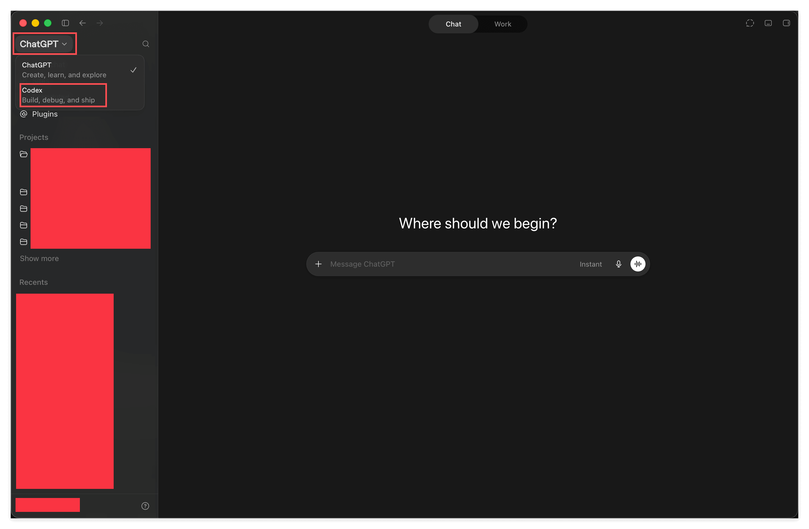

The menu has two entries:

- **ChatGPT**, subtitled Create, learn, and explore. This is the mode you use for everyday chatting.
- **Codex**, subtitled Build, debug, and ship. This is the mode for getting work done.

Choose **Codex**.

This is a perfect illustration of the architecture from Task 03: the same underlying model, wrapped in two different shells. The ChatGPT layer is a chatbot: you ask, it answers. The Codex layer is an Agent: it can read your files, edit your files, and work through a task step by step on its own. Flipping this switch means you're swapping shells.

### 2. Add your project

Once you switch over, the interface changes. The left sidebar shows New chat, Pull requests, Sites, Scheduled, Plugins, and below that, Projects and Recents. The middle of the screen reads, in big letters, What should we build?

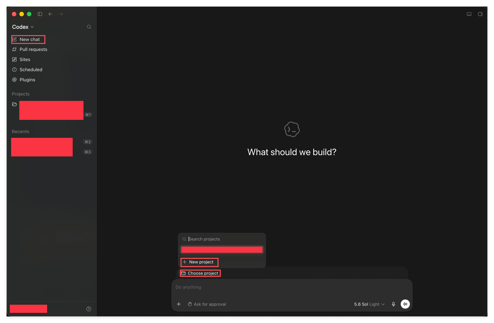

**Before you touch anything: clone this teaching repo to your machine.** Codex needs a folder to work in; without one, it has nowhere to start. This is exactly what Task 02 meant by "one project equals one folder, and that folder is a repo."

Once it's cloned, click **Choose project** above the input box. A small panel pops up with a search field and two options, **New project** and **Choose project**. Click **New project**.

The Create project dialog appears, with two things to fill in:

- At the top, the **project name**. The screenshot shows learn_install_ai_agent_desktop_app-project.
- Below that, **Source folders**, where you pick the folder you just cloned. Notice there's an **Add folder** option here too, meaning a single project can have multiple folders attached. You won't need that yet; just know it's there.

Fill it in and click **Create project**.

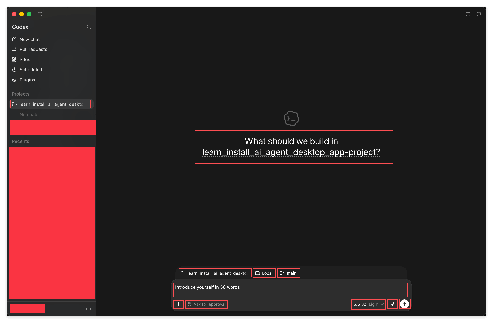

Once it's created, you'll notice three changes: the project now appears under Projects on the left; the big heading in the middle now reads What should we build in learn_install_ai_agent_desktop_app-project; and three small buttons have appeared above the input box, labeled with the **project name**, **Local**, and **main**.

> The project name in the screenshot is `learn_install_ai_agent_desktop_app-project`, the old name of this course's repo before it was renamed. This course's repo is now called `learn_ai_agent_desktop_app_basic` (the old name wasn't precise enough, so it got changed). When you create your own project, the name you type in will be the new one, so it's expected that it won't match the screenshot.

The next four subsections walk through those three buttons, plus the row along the bottom of the input box, one at a time.

In the screenshot, I typed Introduce yourself in 50 words into the input box; feel free to type the same thing. It's the easiest possible first message, and it's just there to confirm the whole pipeline works end to end.

### 3. Local, deciding where the work happens

Click **Local** above the input box.

The menu title reads Start in, meaning: where should this task start from?

- **Work locally**: work directly in your local folder.
- **New worktree**: open a separate, independent working copy.
- **Connect Codex web** and **Send to cloud**: send the work off to run in the cloud.
- **Usage remaining**: check how much of your usage limit is left.

**When do you use which?** For a long stretch of time, your answer will just be **Work locally**, and it's also the default. It means the AI works directly, right in front of you, on your actual folder. The upside is what-you-see-is-what-you-get: the moment it changes something, you can see it in Finder or your editor. The downside is that if it makes a mistake, it's a real mistake, which is exactly why the approval mode covered in the next section exists as a safety net.

**New worktree** solves a different problem: you want to push forward on two or three unrelated things at once without them fighting over the same files. A worktree gives you several isolated working copies of the same repo, so each task stays out of the others' way. It's a genuinely useful advanced feature, but it assumes you're already reasonably comfortable with git. For now, just know it exists; you don't need to touch it.

**Connect Codex web** and **Send to cloud** send the task off to run on OpenAI's own machines instead of using your computer. They're good for work that takes a long time to run when you'd rather close your laptop and walk away. Set these aside for now too, and come back to them the day you actually hit a "this is going to take half an hour and I don't want to babysit it" situation.

**Usage remaining** is worth memorizing the location of right now. Task 04 already warned you that the free tier runs out fast; this is the quickest way to check how much you have left. Make it a habit: the moment things feel slow or start throwing errors, check here first instead of guessing whether it's a usage problem.

### 4. main, deciding which branch to work on

Click **main**.

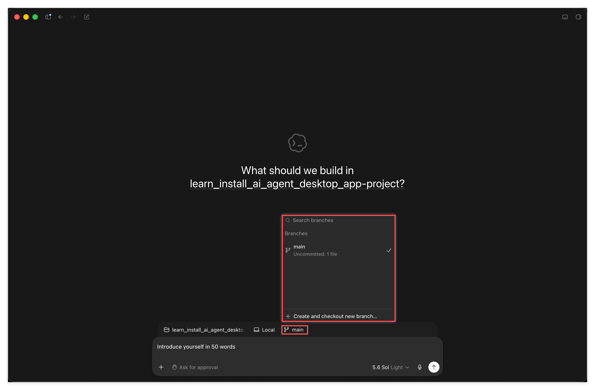

This is the git branch picker: a search field at the top, all your branches listed in the middle, and at the bottom, **Create and checkout new branch**, which lets you create a new branch and switch to it in one step.

**When do you use this?** As a beginner, staying on **main** is fine, and you can skip this whole section entirely. But there's one scenario you'll eventually run into: you're about to have the AI do something with a fairly large blast radius, you're not fully confident about it, and you don't want to risk messing up your main line of work. That's when you create a new branch here, let it make its mess on that branch, merge it back if you're happy, or just throw the branch away if you're not, leaving main completely untouched. This is git's built-in "undo everything" button, and this UI element lets you use it without dropping into the terminal to type commands.

Also notice the small text under main that reads **Uncommitted: 1 file**, telling you how many files currently have changes that haven't been committed. This detail is more useful than it looks: the AI works fast, and a single round might touch seven or eight files. That number is your reminder, so you don't finish a session and forget what you actually changed, and so you don't stack a fresh pile of edits on top of a pile of uncommitted ones.

Worth restating here why Task 02's prerequisite mattered. Branches, commits, and pushes aren't ceremony reserved for programmers; they're the only reliable undo mechanism you have when working alongside an AI. If you don't know any git at all, this button is just decoration to you. Know a little, and it becomes your seatbelt.

### 5. Approval mode, the single most important switch

Click **Ask for approval** in the bottom-left corner of the input box.

The dialog that pops up is titled How should ChatGPT actions be approved, with three levels:

- **Ask for approval**: Always ask to edit external files and use the internet. The strictest setting; it has to ask you every single time before touching a file or going online.
- **Approve for me**: Only ask for actions detected as potentially unsafe. It makes its own judgment call, only checking in when it thinks something might be risky.
- **Full access**: Unrestricted access to the internet and any file on your computer. Nothing gated at all.

How do you choose? Here's an honest breakdown of how people actually use this:

**Approve for me is what most people land on, used by more than 70% of users.** It strikes a comfortable balance between "stop bothering me" and "don't let anything go wrong," and it's the level I'd recommend for everyday use.

**Ask for approval is stricter.** The upside is that you know exactly what it's about to do at every step. It's worth using in your first few days, partly just to observe what kinds of actions the Agent actually takes, so you build intuition. The downside is that it asks so often it gets tiresome once you're past that stage.

**Full access is for power users**, and it comes with one condition: you have to be able to absorb your own losses if something goes wrong and just accept it. It can touch any file on your computer without asking. Don't touch this unless you're completely certain what you're doing.

**When should you switch levels?** Here's a practical rhythm: use Ask for approval for the first few days to get a clear picture of how it behaves, and once you feel comfortable, settle into Approve for me long-term. After that, there's really only one situation worth temporarily loosening things further: when you're about to have it do something with a huge number of steps (say, cleaning up dozens of files in one go), and you've already confirmed there's nothing in this repo you can't afford to lose. Loosen it temporarily for that, then dial it back down when you're done.

One more piece of experience: **approval mode and the undo mechanism go hand in hand.** The looser you set approval, the more you should be leaning on the branch trick from the previous section. Use them together, and you get to avoid being pestered with questions while still being able to roll everything back at any point.

### 6. Opening the model settings panel

Look at the bottom-right of the input box, where it reads **5.6 Sol Light**. Click it.

A small panel pops up with an **Advanced** option and a four-position slider.

Let's talk about the slider first. It's a quick-adjust control: drag it and the level changes, no need to open a menu. It controls **Effort** (how hard the model thinks), covered below, which is the setting among the three you'll change most often. That's exactly why it's a slider: it's a high-frequency action, so it deserves a one-step entry point.

To see all the options, click **Advanced** to expand it, which reveals three rows: **Model**, **Effort**, and **Speed**.

**Get the big picture first before diving in.** These three aren't three parallel switches; they each control something completely different: **Model decides which brain you're using, Effort decides how much thought that brain puts in, and Speed decides how fast you get results.** Keep that division straight and the next three subsections will make a lot more sense. One more thing: all three can be changed at any time, and a change only applies **to the next message you send**, not to anything already said. So don't be afraid to experiment; opening these up and trying different combinations is the best way to learn what they do.

### 7. Model, choosing which brain

Click **Model**.

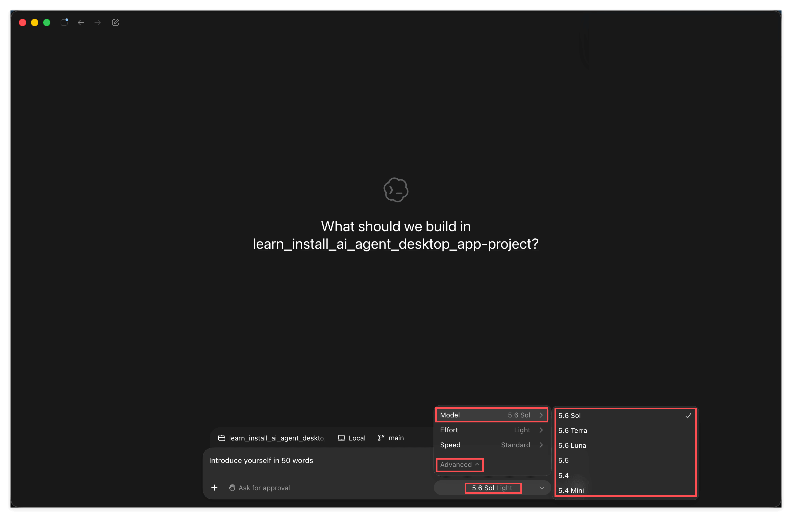

The list shows 5.6 Sol, 5.6 Terra, 5.6 Luna, and below those, 5.5, 5.4, and 5.4 Mini.

For the three 5.6-generation models, three sentences are all you need:

- **Sol**: the flagship. The most capable one.
- **Terra**: very well-balanced, and the one you'll use most. When in doubt, pick this.
- **Luna**: the choice when usage is tight. If you want to keep working without constantly slamming into your usage limit, use this.

**When do you use which?** Default to **Terra**. It's the tier where, on the vast majority of tasks, you honestly can't tell the difference from the flagship, but it's noticeably cheaper to run. Everyday reading, organizing notes, writing documents, editing things: it handles all of it comfortably.

Save **Sol** for tasks that genuinely feel hard: a stubbornly complex problem, something you keep revising and still aren't happy with, or a case where you need a high-quality result on the first try and don't want to go back and forth. That's when the flagship's edge actually shows. On the flip side, using Sol to summarize a simple article buys you no visible improvement for the extra usage it costs.

**Luna** is the budget-conscious tier. When do you switch to it? Two situations: first, your usage for the month is already running low but you still have a stack of less important chores to get through; second, you're about to run many rounds back to back (say, cleaning up twenty files in one sitting), and rather than running out of usage halfway through, you'd rather run the whole thing steadily on Luna. Remember what Task 03 said: what you're paying for is compute, so "good enough" is a genuinely sound cost-saving strategy here, not a compromise.

The 5.5, 5.4, and 5.4 Mini options below are the previous generation, and you generally don't need to worry about them. The one scenario where they matter is if you hit a strange issue on a newer version and want to roll back to an older one to check whether the new model is the culprit.

### 8. Effort, how deeply it thinks

Click **Effort**.

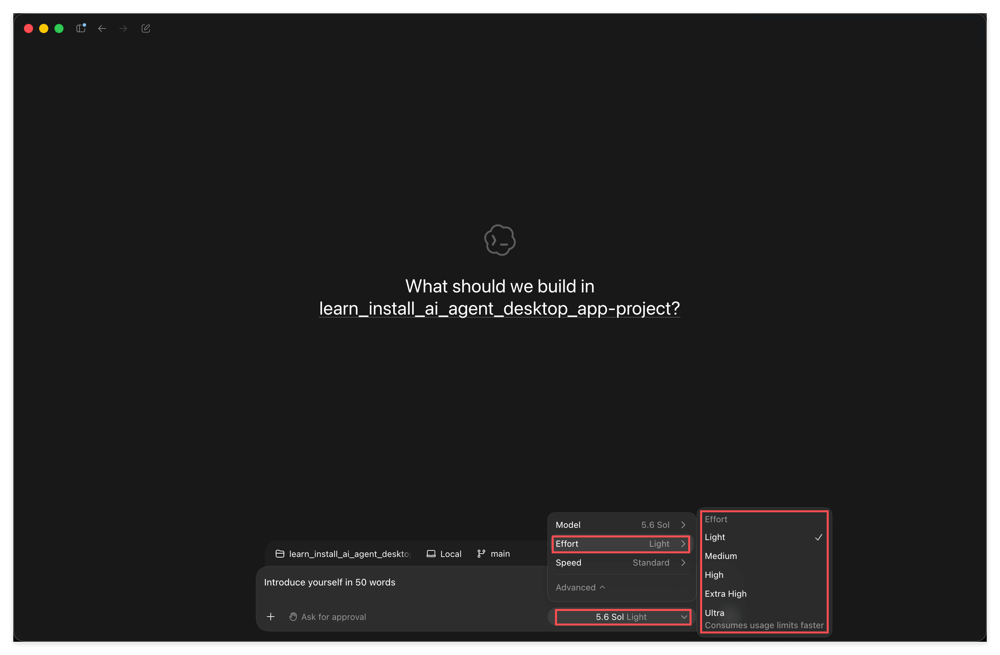

Five levels: **Light**, **Medium**, **High**, **Extra High**, and **Ultra**. The last one has a note underneath it: Consumes usage limits faster.

There's a common misconception worth clearing up first: **higher isn't automatically better.** Turning it up means it thinks longer, which also means it burns more tokens and eats into your usage faster. Setting Ultra for a trivial task is just waste.

Rough guidance:

- For things like **having it read an article and explain it to you**, or general digesting of information, **Light** is enough. These tasks don't require deep reasoning to begin with.
- For **cross-referencing multiple files**, or **writing code**, **Medium** generally does the job.
- Only for **genuinely complex systems**, **fuzzy, ill-defined problems**, or **open-ended brainstorming with no single right answer** is it worth reaching for **High** or above.

Practical advice: **start low and work up.** Run it at a low level first; if the answer feels shallow and misses the point, bump it up a notch. Going straight to the top setting, by contrast, usually shows no noticeable difference while burning through your usage fast.

How do you know when to raise it? A few clear signals: the answer is technically correct but hollow, all correct-sounding filler; it misses a point you consider obviously important; or it hands you a plan that clearly overlooked a pitfall you spotted immediately. All of these mean it isn't thinking deeply enough, and bumping the level up usually helps right away.

There are also signals in the other direction, telling you it's set too high: you waited a long time and got roughly the same result as a lower level; or it wanders in circles on a question that was actually pretty straightforward, overthinking itself off track. Dial it back down when you see that.

**Use Ultra sparingly.** The interface specifically flags it with Consumes usage limits faster, and that warning carries real weight. Unless you're genuinely facing an open-ended problem with no standard answer, it's usually not worth it.

### 9. Speed, a somewhat different kind of option

Click **Speed**.

Just two levels: **Standard** (Default speed) and **Fast** (1.5x speed, more usage).

This option is different from the previous two: **it doesn't change how smart the model is, only how fast it produces a result.** Model and Effort both control "will the result be better," while Speed controls "will the result arrive sooner." What you're spending usage on here is purely time.

The interface is blunt about it: Fast means 1.5x speed, more usage. 50% faster, at the cost of more usage. This is purely a trade, with no other benefit attached: same question, same answer, just delivered to you a bit sooner.

**When is it worth paying for?** One case is when you're blocked on the result before you can take your next step, and every minute of sitting idle is wasted, say, someone's suddenly asking you to turn something around quickly. The other is when you're doing work that requires many rounds of back-and-forth, each one with a wait; saving tens of seconds per round adds up across a dozen rounds, and what you're really saving is your attention, which is worth more than usage.

**Stick with Standard most of the time.** Especially when you're planning to go do something else after sending off a task; that extra 50% speed does nothing for you and is pure waste. That's also why this is the last of the three I'm covering: of the three options, it's the one you'll need to touch the least.

### 10. Give it a screenshot and have it write a file to a location you specify

With the widgets covered, let's get to the real work.

First, a quick recap of how this conversation started. Remember the line I typed into the input box back in section 2, **Introduce yourself in 50 words**? That was this conversation's first message, and I picked it deliberately.

Why that particular line? For three reasons: it's guaranteed to get an answer, so it confirms the whole pipeline works; I capped it at **50 words**, so it answers fast without wasting your time or your usage; and once it answers, you get a clean look at what the app's full working interface looks like. It's a very high-value opening move, and you can reuse a version of it every time you set up a new tool, just to sanity-check it.

**Then comes the key step: after seeing its answer, I took a screenshot of the Codex interface itself and handed it right back.**

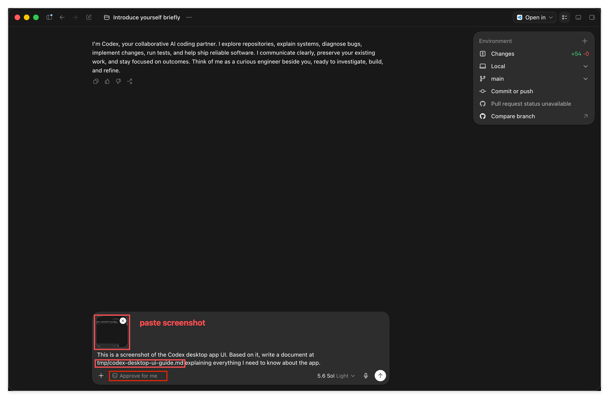

I did two things in this round.

**First, I handed it a screenshot.** Just paste it directly into the input box (Cmd+V); the image shows up as an attachment above the input field.

By the way, **you can also just give it the image file's path directly**, and it works the same way. The path approach is actually more flexible; pasting is just more convenient for a human. Keep both options in mind, since you'll use them again later.

There's a technique worth pulling out on its own here, one that matters more than any specific detail in this whole section:

> **Don't know how to use a piece of software? Take a screenshot, hand it to the AI, and just ask.** It's the simplest, most direct approach there is, and it works for any piece of software, not just Codex.

This isn't a shortcut or a trick; it's genuinely one of the most practical ways to learn in this era. In the past, hitting an unfamiliar interface meant searching for tutorials, digging through docs, watching videos, and those resources often didn't even match the version in front of you. Now you can just show it exactly what you're looking at and have it explain that specific version of the interface to you.

**And you should keep following up.** Click through what it tells you, and if you find what it described doesn't match what you're actually seeing (which happens a lot, since software updates faster than a model's knowledge does), don't just stop there. **Take another screenshot, send it back, and have it search the web while you're at it.** It'll come back with an updated answer based on current information. After two or three rounds of this back-and-forth, you'll often understand the software better than most people who only ever read a tutorial.

Make this a habit: **screenshot and ask when you're confused, screenshot again and search the web when something doesn't match.** If you take away nothing else from this course, take away this.

**Second, I told it exactly where to write the result.** The instruction I gave was:

> This is a screenshot of the Codex desktop app UI. Based on it, write a document at tmp/codex-desktop-ui-guide.md explaining everything I need to know about the app.

Notice that `tmp/codex-desktop-ui-guide.md` is a **path relative to the project root**. You could also give it an **absolute path**, like `${HOME}/Documents/GitHub/your-repo/tmp/xxx.md`; both work.

Why `tmp/`? Because this repo's `.gitignore` excludes `tmp/`; it's specifically set aside for temporary output, so writing there won't clutter your git history. This is a good habit to build: **when you have the AI write files, be explicit about where they should go**, and don't let it guess.

By the way, I switched approval mode to Approve for me for this round, otherwise it would have had to ask me before writing every single file.

Also take a look at the **Environment** panel in the top right: Changes shows +54 -0, and below that, Local, main, and **Commit or push**. In other words, once the edits are done, you don't need to drop into a terminal; you can commit and push right here. This is exactly where the GitHub prerequisite from Task 02 pays off.

### 11. Reviewing what it changed, without leaving the app

It finished.

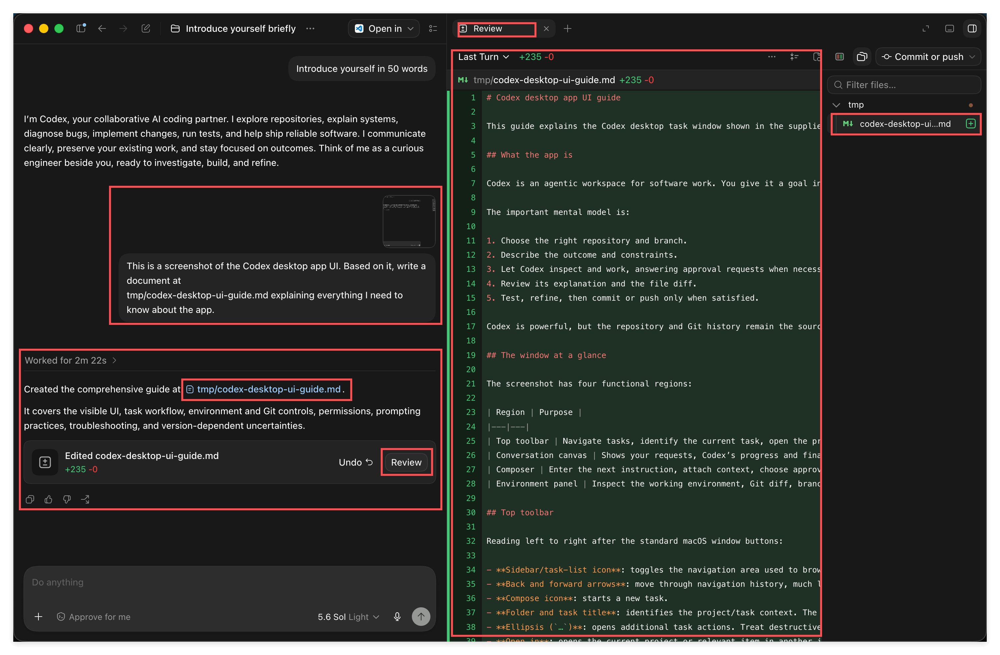

The chat pane on the left says Worked for 2m 22s and shows that it created `tmp/codex-desktop-ui-guide.md`. Below that, a card reads Edited codex-desktop-ui-guide.md **+235 -0**, with two buttons next to it: **Undo** and **Review**.

Click **Review**, and a diff opens in a split pane on the right, all green since it's entirely new lines. **Undo** instantly reverts the change, so you can back out any time you regret something.

This is a habit worth internalizing: **whenever the AI finishes editing something, take a look.** No matter how fast it writes, you're still the one responsible for the result.

Besides Review in the chat log, there's also a built-in file browser. Click the **+** on the right-side tab bar.

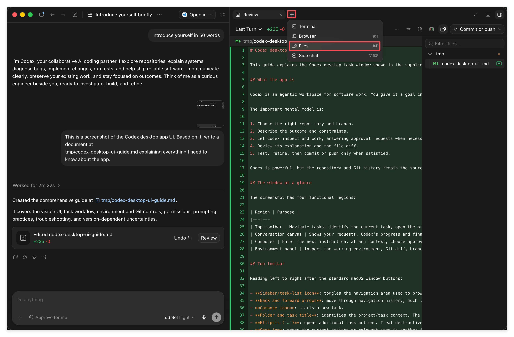

The menu has four entries: **Terminal**, **Browser**, **Files**, and **Side chat**. Choose **Files**.

The full file tree appears on the right. Click any file to see its contents, and Markdown files render nicely formatted. There's a breadcrumb up top showing you exactly where you are.

So the entire flow never requires leaving this app: hand off the task, watch it work, review the changes, browse the files, commit and push, all in one window.

### 12. Getting work done with an Agent Skill

Now it's time to deliver on the promise made back in Task 02: actually using an **Agent Skill** yourself.

The task is simple: this repo has a long article under `resources/`, an OpenAI piece about Agent Skills called `openai-agent-skills.md`, and we're going to have the AI summarize it.

**First, hand that long article to the AI.** This time, use a different method: find it in the file tree on the right and right-click it.

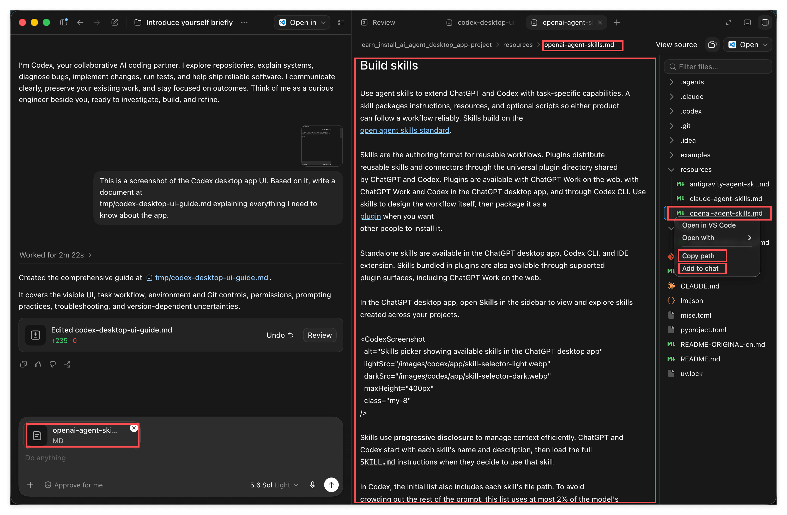

The menu shows **Copy path** and **Add to chat**:

- **Add to chat**: attaches the file directly to the input box as an attachment. That openai-agent-ski... MD entry in the bottom left of the screenshot is it.
- **Copy path**: copies the path so you can paste it in yourself.

This is **a second way to hand material to the AI**. Combined with pasting a screenshot and giving a raw path, that's three ways in your toolkit now. Giving a path is obviously the most flexible, but right-clicking twice is clearly more convenient for a human. Use whichever feels natural.

**Now invoke the skill.** Type a slash `/` into the input box, followed by the first few letters of the skill's name.

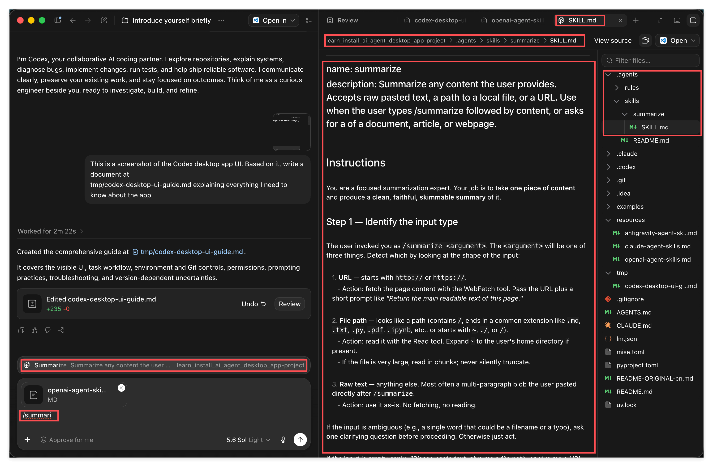

I typed `/summari`, and the candidate **Summarize** popped up above, along with its description and which project it belongs to. Press **Tab** to auto-complete.

Besides slash `/`, you can also invoke a skill with `$` followed by the name; both do a fuzzy search, so you don't need to type the full name.

On the right, I also pulled up the skill's actual source: `.agents/skills/summarize/SKILL.md`. **Looking at that path tells you everything: from Codex's point of view, an Agent Skill is really just a file that defines a capability.** Task 02 mentioned that a Skill can also bundle reference material, scripts, tools, and so on, and that's all true, but this example is kept minimal, just a single file, spelling out exactly how this "summarization expert" should operate: how to tell whether the input is a URL, a file path, or plain text, what structure the output should have, and what quality bar it needs to meet.

**After autocompleting, add your instruction after it.**

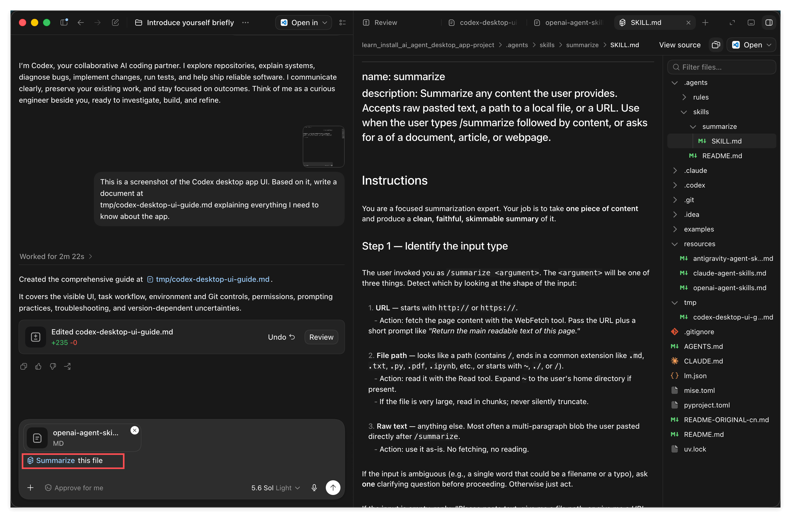

After autocomplete, the input box shows the **Summarize** skill tag, and I followed it with this file. Read together, it says "summarize this file," where this file refers to the attachment above.

Worth emphasizing here: **once you've invoked a skill, you can say pretty much anything after it; the AI isn't dumb, it understands what you're asking for.** There's no rigid phrasing you need to memorize.

**Now look at the result.**

The result came back in 12 seconds, structured like this: a **Source** line naming where it came from, a **(1 sentence)** one-line summary, **Key points** with seven bullets, and **Notable details** for additional context.

Pause and appreciate what just happened: **I never specified any formatting requirements at all.** I never said to include a one-sentence summary, never said to list seven points, never said to cite the source. But the output followed that exact structure, because all of that is spelled out in `SKILL.md`.

This is exactly what Task 02 called "building an expert." You think through how a certain kind of task should be done, once, package it as a Skill, and from then on every summary comes out at that same standard, with no need to explain it again.

### 13. Sessions and context, a concept you need to internalize

There's no screenshot for this subsection, but it's the part of this whole article you most need to actually understand. The buttons from earlier become familiar after a few clicks; if you don't understand what's covered here, you'll keep feeling like the AI is "smart sometimes and clueless other times" without ever figuring out why.

**Let's start with sessions.** A session is one continuous conversation, starting the moment you click **New chat** and lasting until you stop chatting in it. Everything we did earlier (introducing itself, writing a document from a screenshot, summarizing a long article) all happened in the same session, which is why it kept remembering what came before, and why it knew exactly which file you meant when you said "this file."

**Now, context.** Every back-and-forth is really just **messages accumulating**. Each time you send a message, it's not just looking at that one line; it re-reads everything in the session so far, and only then answers you. That "everything so far" is the context, and it has a hard capacity limit.

Here's the single most important, and most easily overlooked, point in this section.

**What's sitting in the context is far more than what you can see in the chat log.**

What do you actually see on screen? A handful of your messages, a handful of its replies. Doesn't look like much. But there's a whole pile of things stacked into the context that you **never see at all**:

- **The full text of files it read.** You had it summarize `openai-agent-skills.md`, a file over two hundred lines long, and all of it went into the context, while the chat log only shows a single line: "Source: resources/openai-agent-skills.md."
- **Its intermediate steps.** To complete a task, it might search a directory, list files, and try reading a few files that turn out to be irrelevant before finding the right one. All of those actions and their results sit in the context, even though the interface often collapses them into a single line like "Worked for 2m 22s."
- **The Agent Skill manifest, and the full text of any skill you invoke.** For every skill you have installed, its name and description have to be loaded in first, or the model wouldn't even know that expert exists to call on; and the moment you actually invoke one, the entire `SKILL.md` gets stuffed in too. You only see a small Summarize tag, but underneath it is an entire set of instructions.
- **What it wrote out.** It generated a 235-line document for you, and what you see is a card that reads "Edited xxx +235 -0," but those 235 lines of content are themselves part of the output, and they take up space too.

So don't fall into the trap of thinking **if it's not shown on screen, it doesn't exist.** It exists, and it's eating into your context just the same, often more than anything else. That's exactly why you can have a conversation that feels like only a dozen exchanges, and yet find that the Status panel already shows a third of your context used up.

**So what happens when it fills up?** AI Agents **automatically compress** older history into a shorter summary to make room to keep going. That's why it feels like you can keep chatting indefinitely without being abruptly cut off.

But you should know the cost of that compression: **compression is lossy, and it has no idea which line mattered most to you.** It makes its own judgment calls about what to keep, and it's entirely possible for the exact detail you cared about most to get compressed away. Ask about it again later, and you'll get a vague answer, or it'll simply misremember. A lot of what people describe as "it got dumber the longer we talked" comes down to exactly this.

So the core takeaway is one sentence: **its attention is not unlimited.**

Which leads to a habit you need to build: **write important information and conclusions into a file, and have it read the file back in whenever you need it.**

It's worth thinking through why this matters: context is volatile, capacity-limited, and gets silently compressed; files are stable, unlimited, and only get deleted when you say so. **Context is not memory; files are memory.** Anything good that comes out of a conversation is fragile as long as it stays in the chat; it's only really saved once it's written to a file. Next time you need it, one line tells it to read the file back in, and what comes back is the complete original text, not a compressed ghost of it.

This is also exactly why Task 02 made GitHub a hard prerequisite: you need somewhere to store all of this, somewhere durable, searchable, and editable.

### 14. Using status to check context and usage

Now that the concept is clear, let's look at the dashboard. Type `/stat` into the input box.

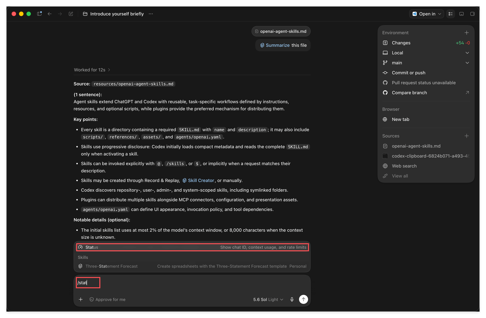

Among the candidates that pop up, the built-in command **Status** (Show chat ID, context usage, and rate limits) appears at the top, with the various skills grouped under Skills below it.

In other words, slash commands aren't only for invoking skills; there's also a set of built-in commands. Choose Status.

Three lines of information:

- **Session**: this conversation's ID.
- **Context**: 67% left (84,550 used / 258K). How much of the context window remains.
- **7d limit**: 97% left (resets Aug 2). How much of your seven-day usage allowance remains, and when it resets.

**The middle line is exactly the capacity gauge from the previous section.** 84,550 used out of 258K total. Think back on how this session didn't actually involve much chatting, but that long article that got read in, all those intermediate steps, and that SKILL.md, all add up to that number. That figure should no longer surprise you.

When should you check it? Two habits are enough: **first, whenever it starts feeling less accurate than it was a moment ago, check whether the context is running full**; second, glance at it before starting a new serious task, and if there isn't much left, open a fresh conversation instead of forcing your way through an already-crowded session.

The same logic applies to the usage number on the last line. When it's running low, switch Model to a cheaper option, or drop Effort down a level; you now know how to use both of those dials.

### 15. Fork, keeping a clean context

One last feature, and a genuinely useful one.

Picture the scenario: you're in the middle of a real task, and your context is still clean. Suddenly you want to ask about something else entirely, unrelated to the task at hand. Ask it directly, and that unrelated detour eats up a chunk of your context. Don't ask, and it nags at you.

**Fork is the solution.**

Look at the small row of icons under each reply; the forked-branch icon on the far right is fork.

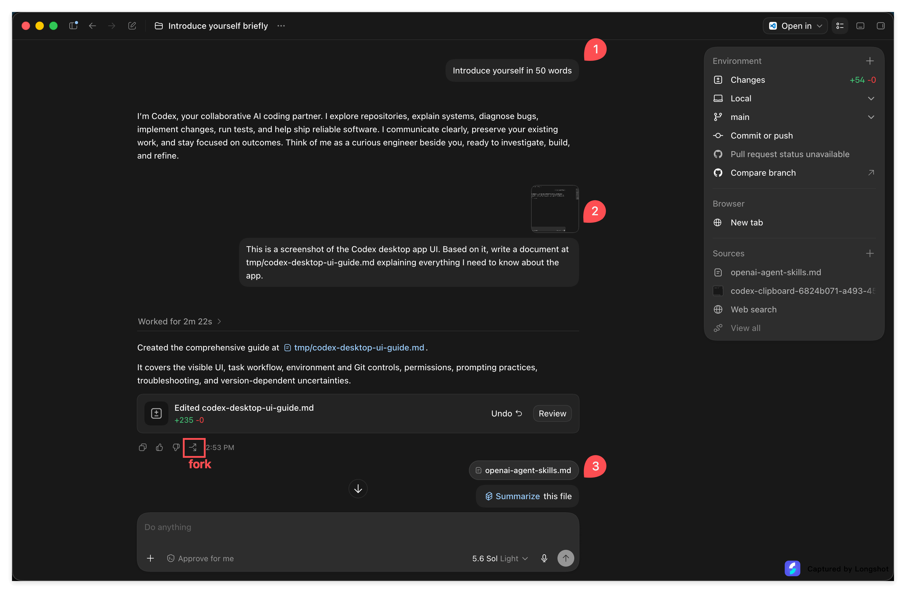

The screenshot marks three messages, 1, 2, and 3. I clicked fork underneath message 2.

A dialog titled Continue in a new chat appears, with two options:

- **Use this workspace**: opens a new conversation in the same workspace, continuing on from that message.
- **Use a new worktree**: opens a separate working copy before continuing. An advanced use case; set it aside for now.

Choose **Use this workspace**.

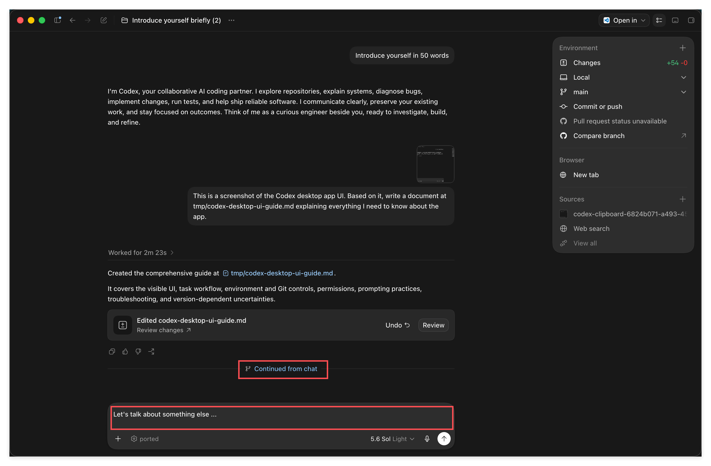

The new conversation is named Introduce yourself briefly (2), with a divider marker in the middle labeled **Continued from chat**. **Notice: it only retains history up through message 2; message 3 (the summarize round) is gone.** That's because I forked from message 2.

So the complete move for that scenario is: first **write the conclusion** of the "let's talk about something else" tangent into a file, then go back to the message right before the detour, **fork a new conversation from there**, and continue the real task with a clean context.

There's an even more valuable use for fork: **load all the background material the AI will need in one go, have it read through everything, and then tell it to stand by.** Starting from that fully-loaded session, fork off several branches, each one exploring a different direction. That way every branch carries the full background with it, while you only had to feed the material in once. What you save is both time and usage.

---

## 6. Recap: Tying It All Together

Let's walk back through everything you just did.

**The two steps to get in the door**: switch ChatGPT to Codex in the top left, moving from the ChatBot shell to the Agent shell. Then add your locally cloned repo as a project, giving it a place to work.

**Four switches around the input box**, the ones with the biggest day-to-day impact:

| Switch | What to remember |
| --- | --- |
| Approval mode | Approve for me is what roughly 70% of people use day to day; Ask for approval is good early on to see exactly what it's doing; Full access is only for power users who can absorb their own losses |
| Model | Sol is the flagship, Terra is balanced and the one you'll use most, Luna saves usage |
| Effort | Higher isn't better, it's more expensive. Use Light for digesting information, Medium for cross-referencing and writing code, and only reach for High or above on complex, ambiguous problems with no standard answer |
| Speed | It buys speed, not intelligence. Use Standard normally, Fast only when you're in a hurry |

Two smaller ones: **Local** decides where the work happens (beginners stick with Work locally, and remember Usage remaining lives here too), and **main** decides which branch you're working on.

**Three ways to hand material to the AI**: paste a screenshot directly, give it a file path directly, or right-click Add to chat in the file tree. Paths are the most flexible, right-click is the most convenient.

**A technique that will serve you for life**: don't know how to use a piece of software, screenshot it and just ask the AI directly; if what it says doesn't match what you see, screenshot again and follow up, and have it search the web while you're at it. This applies to any piece of software.

**When having it write files**, specify the path explicitly; relative and absolute paths both work. Put temporary output in `tmp/`, which is excluded via gitignore.

**Always review what it changed**: click Review in the chat log to see the diff, click Undo if you change your mind. The **+** on the right opens Terminal, Browser, Files, and Side chat, and the file browser lets you see rendered output directly. Commit and push live in the Environment panel in the top right.

**Agent Skill**: fuzzy-search with `/` or `$` plus a name, Tab to autocomplete, and follow it with any instruction you like. Its actual form is just a file (`.agents/skills/summarize/SKILL.md`) that spells out exactly how that expert should operate. Its value is this: you think through "how should this kind of task be done" once, and every time after that comes out at that same standard.

**Sessions and context**: a conversation is a session, messages keep accumulating, and the window has a cap. The most important point is that **the context holds far more than the handful of lines you can see**: the full text of files it read, all the intermediate steps it tried, the SKILL.md content it pulled in, the entire document it wrote out, all of it takes up space, even though the interface usually collapses it down to a single line. When it fills up, it auto-compresses, which is why you can keep chatting without an abrupt cutoff, but compression is lossy and it doesn't know which line mattered to you. So write important conclusions into files: context isn't memory, files are. Use `/status` to check context and usage.

**Fork**: branches a new conversation off a specific message, inheriting only the history up to that point. Use it to keep a clean context, and to explore multiple directions in parallel from a session that's already loaded with background material.

---

## 7. Exercise

### Exercise: Walk through all twenty-four screenshots yourself

**Goal:** perform every action covered above with your own hands. Once you've done this, the app is truly yours.

**How:**

1. Clone this teaching repo to your machine.
2. Open the ChatGPT desktop client and switch to Codex in the top left.
3. Use New project to add the folder you just cloned as a project.
4. Send your first message (Introduce yourself in 50 words works fine) to confirm the whole pipeline works.
5. Click through all six widgets: Local, main, approval mode, Model, Effort, and Speed. Set approval mode to Approve for me.
6. Take a screenshot of the Codex interface itself, paste it into the input box, and have it write a document based on that image into some `.md` file under `tmp/`.
7. Once it's done, click Review to see the diff. Then use the `+` on the right to open Files, and find that file in the file browser to see its rendered output.
8. Read through the document it wrote, pick something that doesn't match what you actually see in the interface, **take another screenshot and follow up, having it search the web too.** See how it corrects itself.
9. Find `resources/openai-agent-skills.md` in the file tree and right-click Add to chat.
10. Type `/summari`, press Tab to autocomplete, follow it with this file, and send. Look at the structure of the output.
11. Type `/status` and check how much context and usage you have left.
12. Pick any message in the middle of the conversation, click fork, choose Use this workspace, and confirm the new conversation only inherited history up to that point.

**What you should observe:**

The output from step 10 will follow a structure you never specified. In step 11, you'll find the context used is far higher than your intuition would suggest (you didn't chat much at all), because the full text of that long article and a bunch of intermediate steps are all in there. In step 12, the forked conversation genuinely no longer includes the messages that came after the fork point.

These three observations map directly to Agent Skills, what actually makes up the context, and context management, respectively. Seeing it happen yourself is worth more than reading about it ten times.

> **Key insight:** you don't need to memorize these buttons; clicking through them once is enough to remember. What you really need to take away are three things: screenshot and ask the AI when you're confused, a Skill is a fixed way of handling a category of task, and context is a resource you need to spend carefully while files are your real memory.

---

## 8. A note from your instructor

**Why this one matters:**

I've seen far too many people install a tool and stop right there. They open it, see a screen full of buttons, have no idea where to start, type a half-hearted "hi, who are you," close it, and never open it again. The tool isn't the problem; what stops them is that feeling of "I have no idea what any of this does."

This article is long on purpose, precisely so you don't have to go through that. Two dozen screenshots, each one a spot you're bound to click eventually. Spend an hour going through all of it now, and you buy yourself hundreds of hours of not hesitating later.

**Key insights:**

- **The Effort section is worth a second read.** The most common way beginners waste resources isn't asking too many questions; it's setting too high a level for a simple task. Getting things done cheaply is a real skill in its own right.
- **Context is a resource with a cost, not free memory.** Once that sinks in, you'll naturally start writing things down into files, and that habit will follow you no matter which tool you switch to.
- **Skills are the direction genuinely worth going deep on.** The buttons in the interface are static; you'll master them after a few clicks. But "turning how you handle a category of task into a standing expert" has no ceiling; how far you take it is entirely up to you.

**Next step:**

Take this app and go do something real with it. Dig up the three things you wrote down back in Task 02's exercise, pick whichever one you're most excited to start, open a new conversation, and get going right in this repo. Along the way, you'll naturally use everything you learned today: handing it material, having it write files, reviewing changes, forking when you go off on a tangent, and saving your conclusions to a file when things start filling up.

That's the moment this course actually pays off for you.
